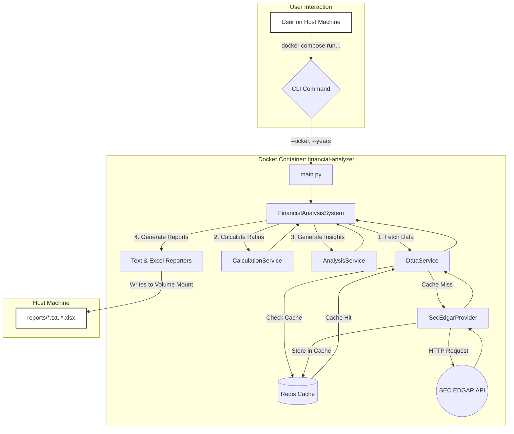

# Automated Financial Analysis System

[](https://github.com/actions)
[](https://opensource.org/licenses/MIT)
[](https://www.python.org/)
[](https://www.docker.com/)

The Automated Financial Analysis System is a professional-grade, command-line tool designed to fetch, analyze, and report on the financial health of publicly traded companies. It leverages official data sources, performs comprehensive ratio calculations, generates qualitative insights, and produces polished reports, all within a portable and reproducible Docker environment.

This project was architected with a focus on modularity, testability, and scalability, making it a robust foundation for further development and a powerful tool for automated financial research.

---

## Table of Contents

-   [**Core Features**](#core-features)
-   [**System Architecture & Workflow**](#system-architecture--workflow)
-   [**Technology Stack**](#technology-stack)
-   [**Project Structure**](#project-structure)
    -   [File Hierarchy](#file-hierarchy)
    -   [Key File Descriptions](#key-file-descriptions)
-   [**Deployment Guide**](#deployment-guide)
    -   [Prerequisites](#prerequisites)
    -   [Step 1: Clone the Repository](#step-1-clone-the-repository)
    -   [Step 2: Configure the Environment](#step-2-configure-the-environment)
    -   [Step 3: Build and Run with Docker Compose](#step-3-build-and-run-with-docker-compose)
-   [**User Guide: Running an Analysis**](#user-guide-running-an-analysis)
    -   [Running the Default Analysis](#running-the-default-analysis)
    -   [Running a Custom Analysis](#running-a-custom-analysis)
    -   [Accessing Reports and Logs](#accessing-reports-and-logs)
    -   [Stopping the Application](#stopping-the-application)
-   [**Testing the System**](#testing-the-system)
-   [**Project Roadmap**](#project-roadmap)
    -   [Immediate Goals (Next Steps)](#immediate-goals-next-steps)
    -   [Long-Term Vision](#long-term-vision)
-   [**Contributing**](#contributing)
-   [**Important Disclaimer**](#important-disclaimer)
-   [**License**](#license)

---

## Core Features

-   **Automated Data Extraction:** Fetches up to 5 years of historical financial data directly from the authoritative U.S. Securities and Exchange Commission (SEC) EDGAR database.
-   **Intelligent Caching:** Integrates a Redis caching layer to dramatically speed up subsequent analyses of the same company and reduce API load, making the system fast and efficient.
-   **Comprehensive Ratio Analysis:** Calculates a wide array of financial ratios across four key categories: Liquidity, Profitability, Leverage, and Efficiency.
-   **Qualitative Analysis Engine:** Translates quantitative data into objective, human-readable insights, analyzing historical trends to assess financial health.
-   **Professional Reporting:** Generates two types of reports for each analysis:
    -   A clean, readable **Text Report (`.txt`)**.
    -   A professional, multi-sheet, and formatted **Excel Workbook (`.xlsx`)** with separate tabs for summary, ratios, and raw financial statements.
-   **Dockerized Deployment:** The entire application and its dependencies (including Redis) are containerized using Docker and orchestrated with Docker Compose, ensuring a one-command setup and consistent execution across any environment.
-   **Modular & Extensible Architecture:** Built with a clean, service-oriented architecture that is easy to maintain, test, and extend with new data sources, calculations, or report formats.

## System Architecture & Workflow

The application operates via a clean, sequential pipeline orchestrated by the `FinancialAnalysisSystem`. The data flows through distinct, modular services, with Redis providing a caching layer for performance.



## Technology Stack

-   **Backend:** Python 3.11
-   **Containerization:** Docker, Docker Compose
-   **Data Processing:** Pandas
-   **Data Validation:** Pydantic
-   **Caching:** Redis
-   **API Interaction:** Requests
-   **Excel Reporting:** openpyxl
-   **Testing:** pytest, pytest-mock

## Project Structure

### File Hierarchy

```
automated-financial-analysis/
│
├── .env.example              # Example environment variables for configuration
├── .gitignore                # Specifies files for Git to ignore
├── docker-compose.yml        # Orchestrates the multi-container environment
├── Dockerfile                # Instructions to build the main application Docker image
├── main.py                   # Command-line entry point for the application
├── README.md                 # This file
├── requirements.txt          # Python project dependencies
│
├── logs/                     # Stores runtime log files (mounted from container)
│   └── .gitkeep
│
├── reports/                  # Default output directory for generated reports (mounted)
│   └── .gitkeep
│
├── src/                      # Main application source code
│   └── financial_analysis/
│       │
│       ├── __init__.py
│       ├── system.py         # The main system orchestrator class
│       │
│       ├── core/             # Core components: data models, config, logging
│       │   ├── config.py
│       │   ├── logging_config.py
│       │   └── models.py
│       │
│       ├── data_providers/   # Modules for fetching data from different sources
│       │   ├── base_provider.py
│       │   └── sec_edgar_provider.py
│       │
│       ├── reporting/        # Modules for generating output reports
│       │   ├── base_reporter.py
│       │   ├── excel_reporter.py
│       │   └── text_reporter.py
│       │
│       └── services/         # Business logic and coordination services
│           ├── analysis_service.py
│           ├── calculation_service.py
│           └── data_service.py
│
└── tests/                    # Unit and integration tests for the application
    ├── __init__.py
    └── services/
        └── test_calculation_service.py
```

### Key File Descriptions

-   **`Dockerfile`**: The blueprint for creating the Python application container. It defines the base image, installs dependencies, and configures the environment.
-   **`docker-compose.yml`**: The master orchestration file. It defines the `financial-analyzer` and `redis` services, connects them via a network, and sets up volumes for persistent data.
-   **`main.py`**: The user-facing command-line interface (CLI). It parses arguments and triggers the analysis pipeline.
-   **`src/financial_analysis/system.py`**: The heart of the application's logic, this file contains the `FinancialAnalysisSystem` class which orchestrates the calls to all services in the correct order.
-   **`src/financial_analysis/core/`**: Contains the project's foundation:
    -   `models.py`: Defines the Pydantic data models (`FinancialStatement`, `FinancialRatios`, etc.) that ensure data consistency and validation throughout the app.
    -   `config.py`: Centralizes all application settings, loading them from environment variables.
-   **`src/financial_analysis/services/`**: This package contains the core business logic, with each service having a distinct responsibility:
    -   `data_service.py`: Manages all data providers and implements the fallback logic.
    -   `calculation_service.py`: Performs all quantitative financial ratio calculations.
    -   `analysis_service.py`: Generates qualitative, text-based insights from the numerical data.
-   **`src/financial_analysis/data_providers/`**: Contains modules for fetching data. `sec_edgar_provider.py` is the primary implementation, complete with Redis caching logic.
-   **`src/financial_analysis/reporting/`**: Contains modules for generating the final output files (`.txt` and `.xlsx`).
-   **`tests/`**: Home to the `pytest` testing suite, ensuring code quality and reliability.

## Deployment Guide

This guide details how to deploy and run the system on a host machine running **Ubuntu 24.04.1 LTS**.

### Prerequisites

1.  **Git:** Required to clone the project repository. Install with `sudo apt-get install git`.
2.  **Docker & Docker Compose:** Required to build and run the containerized application. If you do not have them installed, follow these steps:

    ```bash
    # Update package lists and install dependencies for Docker's repository
    sudo apt-get update
    sudo apt-get install -y ca-certificates curl

    # Add Docker’s official GPG key for package verification
    sudo install -m 0755 -d /etc/apt/keyrings
    sudo curl -fsSL https://download.docker.com/linux/ubuntu/gpg -o /etc/apt/keyrings/docker.asc
    sudo chmod a+r /etc/apt/keyrings/docker.asc

    # Set up the Docker repository in your apt sources
    echo \
      "deb [arch=$(dpkg --print-architecture) signed-by=/etc/apt/keyrings/docker.asc] https://download.docker.com/linux/ubuntu \
      $(. /etc/os-release && echo "$VERSION_CODENAME") stable" | \
      sudo tee /etc/apt/sources.list.d/docker.list > /dev/null
    
    # Install Docker Engine, CLI, and Compose plugin
    sudo apt-get update
    sudo apt-get install -y docker-ce docker-ce-cli containerd.io docker-compose-plugin
    ```
3.  **Configure Docker Permissions (Optional but Recommended):** To run Docker without `sudo`, add your user to the `docker` group.

    ```bash
    sudo usermod -aG docker ${USER}
    ```
    **You must log out and log back in for this change to take effect.**

### Step 1: Clone the Repository

Navigate to the directory where you want to store the project and clone it from your source control.

```bash
git clone <your-repository-url>
cd automated-financial-analysis
```

### Step 2: Configure the Environment

The application requires a `User-Agent` to be set for making requests to the SEC. This is configured via an environment file.

Copy the example file to create your local configuration:

```bash
cp .env.example .env
```

Now, **open the `.env` file** with a text editor (e.g., `nano .env`) and **change the `SEC_USER_AGENT`** to your own information (e.g., `"Your Name or Project your-email@example.com"`). Save and close the file.

### Step 3: Build and Run with Docker Compose

With Docker running and the `.env` file configured, you can now build and run the entire application stack with a single command from the project's root directory.

```bash
docker compose up --build
```

-   `up`: This command tells Docker Compose to start the services defined in `docker-compose.yml`.
-   `--build`: This flag forces Docker to build the `financial-analyzer` image from the `Dockerfile` before starting. This is necessary for the first run or anytime you change the `Dockerfile` or `requirements.txt`.

This command will:
1.  Pull the official `redis:7-alpine` image from Docker Hub.
2.  Build your custom `financial-analyzer` image based on the `Dockerfile`.
3.  Create and start both the `redis` and `financial-analyzer` containers.
4.  Connect them to a shared network.
5.  Run the default command specified in `docker-compose.yml` (e.g., analyze `MSFT`).

You will see the logs from the application streaming in your terminal.

## User Guide: Running an Analysis

While `docker compose up` is great for starting the services, the primary way to use this tool is to perform one-off analysis runs for specific companies.

### Running the Default Analysis

The easiest way to test the system is to just run `docker compose up`. This will execute the default command set in the `docker-compose.yml` file.

### Running a Custom Analysis

To analyze a specific ticker with custom parameters, use the `docker compose run` command. This starts a new, temporary container for the analysis and automatically removes it when done (`--rm` flag).

**Base Command:**

```bash
docker compose run --rm financial-analyzer python3 main.py --ticker <TICKER_SYMBOL> --years <NUM_YEARS>
```

**Examples:**

-   **Analyze Apple Inc. (`AAPL`) for the default 5 years:**
    ```bash
    docker compose run --rm financial-analyzer python3 main.py --ticker AAPL
    ```

-   **Analyze NVIDIA (`NVDA`) for the last 3 years:**
    ```bash
    docker compose run --rm financial-analyzer python3 main.py --ticker NVDA --years 3
    ```

-   **Analyze Alphabet Inc. (`GOOGL`):**
    ```bash
    docker compose run --rm financial-analyzer python3 main.py --ticker GOOGL
    ```

### Accessing Reports and Logs

Because we configured volume mounts in `docker-compose.yml`, all generated files are saved directly to your host machine.
-   **Reports:** Check the `reports/` directory in the project root. You will find the `.txt` and `.xlsx` files there.
-   **Logs:** Check the `logs/` directory for the detailed `financial_analysis.log` file, which is useful for debugging.

### Stopping the Application

When you are finished, stop and remove all containers, networks, and named volumes created by Compose with a single command:

```bash
docker compose down
```

## Testing the System

The project includes a suite of unit tests built with `pytest` to ensure the core logic is correct and reliable. The tests are designed to run in isolation by mocking external dependencies like network calls.

To run the tests, execute the following command from the project's root directory:

```bash
pytest
```

This will automatically discover and run all test files located in the `tests/` directory and provide a summary of the results. This is a crucial step to run after making any changes to the business logic in the `services/` directory.

## Project Roadmap

This project provides a powerful foundation. Here is a roadmap of potential improvements and future features.

### Immediate Goals (Next Steps)

-   **Expand Data Providers:** Implement a secondary data provider (e.g., using the `yfinance` library) and integrate it into the `DataService` as a fallback for tickers not available on SEC EDGAR or for fetching market data.
-   **Add HTML Reporter:** Create a new `HtmlReporter` using a templating engine like Jinja2 to generate visually appealing HTML reports.
-   **Enhance Ratio Calculations:** Add more complex financial ratios, such as those that require averaging balance sheet figures over two periods (e.g., a more accurate Asset Turnover).
-   **Improve CLI Arguments:** Add more command-line flags, such as `--format` to allow users to select which report types to generate (e.g., `--format excel`).
-   **Comprehensive Test Coverage:** Expand the test suite to cover all services and providers, aiming for high code coverage.

### Long-Term Vision

-   **Web API Development:** Expose the analysis pipeline via a RESTful API using a framework like FastAPI. This would allow other applications to programmatically request financial analyses.
-   **Interactive Web Frontend:** Build a web-based user interface (e.g., using React or Vue.js) that interacts with the backend API, allowing users to input tickers and view reports in their browser.
-   **Data Visualization:** Integrate charting libraries (e.g., Plotly, Matplotlib) to generate historical trend charts for key metrics and include them in the HTML reports.
-   **Industry Benchmarking:** Implement a system to fetch data for industry peers and calculate benchmark ratios, providing context for a company's performance relative to its competitors.
-   **Advanced Analysis with ML/AI:** Explore using Natural Language Processing (NLP) to analyze the "Management's Discussion and Analysis" (MD&A) section of 10-K filings to extract qualitative insights and sentiment.

## Contributing

Contributions are welcome! If you would like to contribute to the project, please follow these steps:
1.  Fork the repository.
2.  Create a new feature branch (`git checkout -b feature/your-feature-name`).
3.  Make your changes and commit them with clear, descriptive messages.
4.  Ensure your code adheres to the project's style and all tests pass.
5.  Push your branch to your fork (`git push origin feature/your-feature-name`).
6.  Create a new Pull Request against the main repository.

## Important Disclaimer

> **This tool is for educational and demonstration purposes ONLY.** The data and analysis generated by this system are retrieved from public sources and are not guaranteed to be accurate, complete, or timely. This application is **NOT a source of financial advice**. Do not base any investment decisions on the output of this software. Always conduct your own thorough research and consult with a qualified financial professional before making any investment. The creators of this software are not liable for any financial losses or damages resulting from its use.

## License

This project is licensed under the MIT License. See the `LICENSE` file for details.

