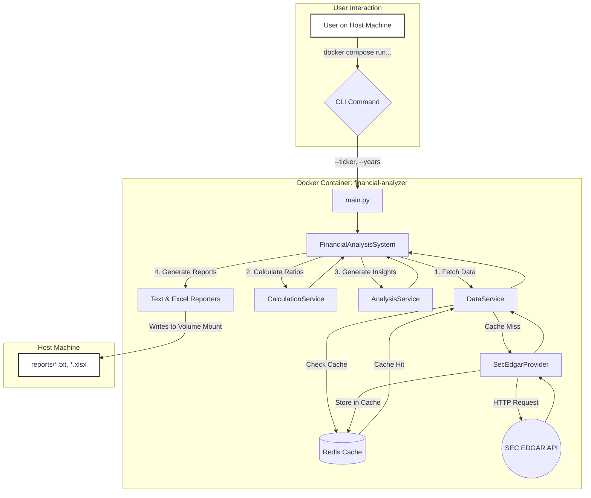

# .env.example
```example
# File: .env.example
# Purpose: Example environment variables. Copy to .env and fill in your details.
# Docker Compose will automatically load variables from a file named .env in the same directory.

# The SEC requires a custom User-Agent in the format 'Sample Company Name your-email@example.com'.
# This helps them identify API traffic. Please replace this with your own information.
SEC_USER_AGENT="Automated Financial Analysis Project contact@mydomain.com"

# Configuration for the Redis cache service
REDIS_HOST=redis
REDIS_PORT=6379
REDIS_DB=0
REDIS_CACHE_EXPIRATION_SECONDS=86400 # 24 hours

```

# docker-compose.yml
```yml
# File: docker-compose.yml
# Purpose: Defines and orchestrates the multi-service application environment.

version: "3.9"

services:
  # The main application service where the financial analysis runs.
  financial-analyzer:
    build:
      context: .
      dockerfile: Dockerfile
    container_name: financial-analyzer-2
    # The depends_on tag ensures that the Redis container is started before this one.
    depends_on:
      - redis
    # The env_file directive tells Compose to read environment variables from a .env file.
    # This is the standard way to manage environment-specific configurations and secrets.
    env_file:
      - .env
    # Volumes mount host directories into the container. This is crucial for:
    # 1. Persisting output: Reports and logs generated inside the container are saved on the host machine.
    # 2. Live development: Changes to the source code on the host are immediately reflected inside the container.
    volumes:
      - ./src:/app/src
      - ./main.py:/app/main.py
      - ./tests:/app/tests # Mount tests for easy execution
      - ./reports:/app/reports
      - ./logs:/app/logs
    # Connects the service to our custom network, allowing it to communicate with Redis.
    networks:
      - financial-network
    # Sets the default command to execute. This can be overridden from the command line.
    # The default command runs an analysis for MSFT.
    command: >
      python3 main.py --ticker MSFT
    # MODIFIED: Changed restart policy to 'no' for this task-based container.
    # It will run once and exit, which is the desired behavior.
    restart: no

  # The Redis service for caching API responses.
  redis:
    # Uses the official Redis image with an Alpine base for a smaller footprint.
    image: redis:7-alpine
    container_name: financial-redis-2
    # Connects the Redis service to the same custom network.
    networks:
      - financial-network
    # Mounts a named volume to persist Redis data across container restarts.
    # This means our cache survives even if the container is stopped and started.
    volumes:
      - redis-data:/data
    # This is a persistent service, so 'unless-stopped' is the correct policy.
    restart: unless-stopped

# Named volumes are managed by Docker and are the preferred way to persist data.
volumes:
  redis-data:

# Defining a custom bridge network is a security best practice. It isolates our
# application services from other containers running on the Docker host.
networks:
  financial-network:
    driver: bridge

```

# Dockerfile
```txt
# File: Dockerfile
# Purpose: Defines the environment and instructions for building the application's Docker image.

# --- Stage 1: Base Image ---
# Use a specific version of the official Python slim image for reproducibility and security.
# 'bookworm' is the stable Debian release corresponding to Python 3.11, ensuring a lean yet complete OS.
FROM python:3.12-slim

# --- Metadata ---
LABEL maintainer="CodeNavigator AI"
LABEL description="Docker image for the Automated Financial Analysis System."

# --- Environment Variables ---
# Prevents Python from buffering stdout and stderr, ensuring logs appear in real-time.
ENV PYTHONUNBUFFERED=1
# Adds the 'src' directory to Python's path, allowing for clean absolute imports.
ENV PYTHONPATH=/app/src
# Sets the working directory for all subsequent commands.
WORKDIR /app

# --- System Dependencies ---
# Update package lists and install essential build tools and libraries required by Python packages
# like pandas, lxml, and Pillow (a dependency of pdfplumber, though not used, it's a common need).
# This ensures native extensions can be compiled successfully.
# We clean up apt cache files in the same layer to reduce image size.
RUN apt-get update && apt-get install -y \
    build-essential \
    curl \
    && rm -rf /var/lib/apt/lists/*

# --- Python Dependencies ---
# Copy only the requirements file first to leverage Docker's layer caching.
# This layer will only be rebuilt if requirements.txt changes, not on every code change.
COPY requirements.txt .

# Upgrade pip and install the Python dependencies into the system's Python environment.
# --no-cache-dir reduces the image size by not storing the pip cache.
RUN pip install --upgrade pip && pip install --no-cache-dir -r requirements.txt

# --- Application Code ---
# Copy the rest of the application source code into the container.
COPY ./src /app/src
COPY main.py .

# --- Final Configuration ---
# Expose the port that a future web interface (e.g., FastAPI, Flask) might use.
EXPOSE 8000

# Set the default command to run when the container starts.
# This provides a sensible default but can be easily overridden in docker-compose.yml or via the command line.
CMD ["python3", "main.py", "--ticker", "AAPL"]

```

# src/financial_analysis/__init__.py
```py
# File: src/financial_analysis/__init__.py
# Purpose: Initializes the 'financial_analysis' package.

```

# src/financial_analysis/services/calculation_service.py
```py
# File: src/financial_analysis/services/calculation_service.py
# Purpose: Performs all financial ratio calculations.

import logging
from typing import Optional

from ..core.models import FinancialStatement, FinancialRatios

logger = logging.getLogger(__name__)

class CalculationService:
    """
    A stateless service responsible for calculating financial ratios
    from a given financial statement.
    """

    @staticmethod
    def _safe_divide(numerator: Optional[float], denominator: Optional[float]) -> Optional[float]:
        """
        Safely divides two numbers, handling None inputs and division by zero.

        Returns:
            The result of the division, or None if the calculation is not possible.
        """
        if numerator is None or denominator is None or denominator == 0:
            return None
        return numerator / denominator

    @staticmethod
    def calculate_ratios(statement: FinancialStatement) -> FinancialRatios:
        """
        Calculates a comprehensive set of financial ratios for a single period.

        Args:
            statement: A FinancialStatement object containing the raw data.

        Returns:
            A FinancialRatios object populated with the calculated ratios.
        """
        logger.info(f"Calculating ratios for {statement.ticker} for FY{statement.fiscal_year}.")
        
        i = statement.income_statement
        b = statement.balance_sheet
        c = statement.cash_flow_statement
        
        # --- Liquidity Ratios ---
        current_ratio = CalculationService._safe_divide(b.current_assets, b.current_liabilities)
        
        quick_assets = None
        if b.current_assets is not None and b.inventory is not None:
            quick_assets = b.current_assets - b.inventory
        quick_ratio = CalculationService._safe_divide(quick_assets, b.current_liabilities)
        
        cash_ratio = CalculationService._safe_divide(b.cash_and_equivalents, b.current_liabilities)

        # --- Profitability Ratios ---
        roe = CalculationService._safe_divide(i.net_income, b.shareholders_equity)
        roa = CalculationService._safe_divide(i.net_income, b.total_assets)
        gross_margin = CalculationService._safe_divide(i.gross_profit, i.revenue)
        net_margin = CalculationService._safe_divide(i.net_income, i.revenue)
        ebitda_margin = CalculationService._safe_divide(i.ebitda, i.revenue)

        # --- Leverage Ratios ---
        debt_to_equity = CalculationService._safe_divide(b.total_debt, b.shareholders_equity)
        debt_to_assets = CalculationService._safe_divide(b.total_debt, b.total_assets)
        times_interest_earned = CalculationService._safe_divide(i.operating_income, i.interest_expense)
        
        debt_service_coverage = None
        if c.operating_cash_flow is not None and b.total_debt is not None:
            # Simplified DSCR - a more accurate version would use scheduled debt payments.
            debt_service_coverage = CalculationService._safe_divide(c.operating_cash_flow, b.total_debt)

        # --- Efficiency Ratios ---
        # Note: Proper turnover ratios use average balance sheet figures.
        # This is a simplification using year-end figures. A future enhancement could average balances.
        asset_turnover = CalculationService._safe_divide(i.revenue, b.total_assets)
        inventory_turnover = CalculationService._safe_divide(i.cost_of_goods_sold, b.inventory)
        receivables_turnover = CalculationService._safe_divide(i.revenue, b.accounts_receivable)
        
        return FinancialRatios(
            ticker=statement.ticker,
            period=statement.period,
            fiscal_year=statement.fiscal_year,
            # Liquidity
            current_ratio=current_ratio,
            quick_ratio=quick_ratio,
            cash_ratio=cash_ratio,
            # Profitability
            roe=roe,
            roa=roa,
            gross_margin=gross_margin,
            net_margin=net_margin,
            ebitda_margin=ebitda_margin,
            # Leverage
            debt_to_equity=debt_to_equity,
            debt_to_assets=debt_to_assets,
            times_interest_earned=times_interest_earned,
            debt_service_coverage=debt_service_coverage,
            # Efficiency
            asset_turnover=asset_turnover,
            inventory_turnover=inventory_turnover,
            receivables_turnover=receivables_turnover,
        )

```

# src/financial_analysis/services/data_service.py
```py
# File: src/financial_analysis/services/data_service.py
# Purpose: Orchestrates one or more data providers to fetch and enrich financial data. (Updated)

import logging
from typing import List, Tuple, Optional

from ..data_providers.base_provider import BaseDataProvider, DataProviderError
from ..core.models import CompanyInfo, FinancialStatement

logger = logging.getLogger(__name__)

class DataService:
    """
    A service responsible for fetching financial data by orchestrating one or
    more data providers. It implements a fallback and data enrichment strategy.
    """

    def __init__(self, providers: List[BaseDataProvider]):
        """
        Initializes the DataService with a list of data providers.
        
        Args:
            providers: A list of data provider instances, ordered by priority.
                       The first provider is considered the primary source for statements.
        """
        if not providers:
            raise ValueError("DataService must be initialized with at least one provider.")
        self.providers = providers

    def fetch_company_financials(
        self, ticker: str, num_years: int
    ) -> Tuple[CompanyInfo, List[FinancialStatement]]:
        """
        Fetches company info and financial statements using an enrichment strategy.
        
        1. It attempts to fetch financial statements from providers in their prioritized order.
        2. The first provider to return statements is considered the primary source.
        3. It then attempts to fetch CompanyInfo from ALL providers to enrich the
           metadata, filling in missing fields like 'sector' or 'industry'.

        Args:
            ticker: The stock ticker symbol.
            num_years: The number of historical years of statements to fetch.

        Returns:
            A tuple containing the merged CompanyInfo object and a list of
            FinancialStatement objects from the primary source.
            
        Raises:
            DataProviderError: If no configured provider can return financial statements.
        """
        company_info: Optional[CompanyInfo] = None
        statements: List[FinancialStatement] = []
        last_statement_error: Optional[Exception] = None

        # --- Step 1: Fetch financial statements from the first available provider ---
        for provider in self.providers:
            provider_name = provider.__class__.__name__
            logger.info(f"Attempting to fetch STATEMENTS for '{ticker}' using {provider_name}.")
            try:
                # Get the base company info and statements from this provider
                company_info = provider.get_company_info(ticker)
                statements = provider.get_financial_statements(ticker, num_years)
                
                logger.info(f"Successfully fetched primary statements for '{ticker}' using {provider_name}.")
                break  # Exit loop on first success
                
            except DataProviderError as e:
                logger.warning(f"Could not fetch statements from {provider_name}: {e}")
                last_statement_error = e
                company_info = None # Reset info if statements failed
                continue
        
        if not statements or not company_info:
            logger.error(f"All providers failed to return financial statements for '{ticker}'.")
            raise DataProviderError(f"Could not retrieve financial statements for '{ticker}' from any source.") from last_statement_error

        # --- Step 2: Enrich company info using all available providers ---
        # The company_info from the successful statement provider is our base.
        merged_info_dict = company_info.model_dump()

        for provider in self.providers:
            provider_name = provider.__class__.__name__
            try:
                logger.info(f"Attempting to ENRICH company info for '{ticker}' using {provider_name}.")
                enrichment_info = provider.get_company_info(ticker)
                
                # Iterate through the fields of the enrichment data
                for key, value in enrichment_info.model_dump().items():
                    # If our base data is missing this field and the enrichment one has it, add it.
                    if merged_info_dict.get(key) is None and value is not None:
                        logger.debug(f"Enriching '{key}' with value from {provider_name}.")
                        merged_info_dict[key] = value

            except DataProviderError as e:
                logger.warning(f"Could not fetch enrichment info from {provider_name}, skipping. Error: {e}")
                continue
        
        # Create the final, enriched CompanyInfo object
        final_company_info = CompanyInfo(**merged_info_dict)
        
        logger.info(f"Completed data fetching and enrichment for '{ticker}'.")
        return final_company_info, statements

```

# src/financial_analysis/services/__init__.py
```py
# File: src/financial_analysis/services/__init__.py
# Purpose: Initializes the 'services' sub-package.

```

# src/financial_analysis/services/analysis_service.py
```py
# File: src/financial_analysis/services/analysis_service.py
# Purpose: Generates qualitative analysis from quantitative ratio data.

import logging
from typing import List, Dict, Any, Optional

from ..core.models import FinancialRatios

logger = logging.getLogger(__name__)

class AnalysisService:
    """
    Generates qualitative, data-driven analysis from historical financial ratios.
    This service translates quantitative data into objective, human-readable insights.
    """

    def _get_trend(self, data: List[Optional[float]]) -> str:
        """Determines the trend from a list of historical data points."""
        # Filter out None values for trend calculation
        valid_data = [d for d in data if d is not None]
        if len(valid_data) < 2:
            return "stable (insufficient data)"
        
        if valid_data[0] > valid_data[-1]:
            return "improving"
        elif valid_data[0] < valid_data[-1]:
            return "declining"
        else:
            return "stable"

    def _analyze_liquidity(self, ratios: List[FinancialRatios]) -> str:
        """Analyzes liquidity position."""
        latest = ratios[0]
        if latest.current_ratio is None:
            return "Liquidity data is not available."

        historical_cr = [r.current_ratio for r in ratios]
        trend = self._get_trend(historical_cr)
        
        text = f"The most recent Current Ratio is {latest.current_ratio:.2f}, showing a {trend} trend. "
        
        if latest.current_ratio >= 2.0:
            text += "This indicates a very strong ability to meet short-term obligations."
        elif latest.current_ratio >= 1.5:
            text += "This suggests a healthy liquidity position."
        elif latest.current_ratio >= 1.0:
            text += "This indicates an adequate but potentially tight liquidity position."
        else:
            text += "This is below 1.0, signaling potential risk in meeting short-term liabilities."
        return text

    def _analyze_profitability(self, ratios: List[FinancialRatios]) -> str:
        """Analyzes profitability metrics."""
        latest = ratios[0]
        if latest.net_margin is None or latest.roe is None:
            return "Profitability data is not available."
            
        historical_nm = [r.net_margin for r in ratios]
        trend = self._get_trend(historical_nm)

        text = (f"The company's latest Net Profit Margin is {latest.net_margin:.2%}, "
                f"with a {trend} trend over the analyzed period. "
                f"Return on Equity (ROE) stands at {latest.roe:.2%}. ")

        if latest.net_margin >= 0.15:
            text += "This indicates excellent profitability and strong operational efficiency."
        elif latest.net_margin >= 0.05:
            text += "This reflects solid profitability."
        elif latest.net_margin > 0:
            text += "Profitability is positive but margins are thin, suggesting competitive pressure or high costs."
        else:
            text += "The company is operating at a net loss, which is a significant concern."
        return text

    def _analyze_leverage(self, ratios: List[FinancialRatios]) -> str:
        """Analyzes debt and leverage position."""
        latest = ratios[0]
        if latest.debt_to_equity is None:
            return "Leverage data is not available."

        historical_de = [r.debt_to_equity for r in ratios]
        trend = self._get_trend(historical_de) # Note: For D/E, "improving" means it's going down.
        
        text = (f"The Debt-to-Equity ratio is {latest.debt_to_equity:.2f}. "
                f"The trend is {trend}, where a declining number is generally favorable. ")
                
        if latest.debt_to_equity <= 0.4:
            text += "This indicates a conservative and strong balance sheet with low reliance on debt."
        elif latest.debt_to_equity <= 1.0:
            text += "This suggests a moderate and generally acceptable level of debt."
        elif latest.debt_to_equity <= 2.0:
            text += "This indicates an elevated level of debt, increasing financial risk."
        else:
            text += "This represents a high level of debt, which may pose significant financial risk."
        return text
        
    def _analyze_efficiency(self, ratios: List[FinancialRatios]) -> str:
        """Analyzes operational efficiency."""
        latest = ratios[0]
        if latest.asset_turnover is None:
            return "Efficiency data is not available."
            
        historical_at = [r.asset_turnover for r in ratios]
        trend = self._get_trend(historical_at)

        text = (f"Asset Turnover ratio is {latest.asset_turnover:.2f}, with a {trend} trend. "
                "This ratio measures how efficiently the company uses its assets to generate revenue. ")
                
        if latest.asset_turnover >= 1.0:
            text += "A ratio above 1.0 suggests efficient use of assets."
        elif latest.asset_turnover >= 0.5:
            text += "This suggests a moderate level of asset efficiency."
        else:
            text += "A low ratio may indicate underutilization of assets or an asset-heavy business model."
        return text
    
    def _synthesize_findings(self, analysis: Dict[str, str], ratios: List[FinancialRatios]) -> Dict[str, Any]:
        """Creates a high-level summary of strengths and weaknesses."""
        latest = ratios[0]
        strengths = []
        concerns = []

        # Liquidity
        if latest.current_ratio and latest.current_ratio >= 1.5:
            strengths.append(f"Strong liquidity ({analysis.get('liquidity', '')})")
        elif latest.current_ratio and latest.current_ratio < 1.0:
            concerns.append(f"Potential liquidity risk ({analysis.get('liquidity', '')})")

        # Profitability
        if latest.net_margin and latest.net_margin >= 0.10:
            strengths.append(f"High profitability ({analysis.get('profitability', '')})")
        elif latest.net_margin and latest.net_margin < 0:
            concerns.append(f"Operating at a net loss ({analysis.get('profitability', '')})")

        # Leverage
        if latest.debt_to_equity and latest.debt_to_equity <= 0.5:
            strengths.append(f"Low financial leverage ({analysis.get('leverage', '')})")
        elif latest.debt_to_equity and latest.debt_to_equity > 1.5:
            concerns.append(f"High debt levels ({analysis.get('leverage', '')})")

        overall = "The company presents a mixed financial profile."
        if len(strengths) > len(concerns) and not concerns:
            overall = "The company demonstrates a strong overall financial position based on the available data."
        elif len(concerns) > len(strengths):
            overall = "The analysis highlights several areas of concern that warrant attention."
        
        return {
            "key_strengths": strengths,
            "key_concerns": concerns,
            "overall_summary": overall
        }

    def generate_qualitative_analysis(self, historical_ratios: List[FinancialRatios]) -> Dict[str, Any]:
        """
        Generates a full qualitative analysis from a historical list of ratios.

        Args:
            historical_ratios: A list of FinancialRatios, sorted from most recent to oldest.

        Returns:
            A dictionary containing textual analysis for each financial area.
        """
        if not historical_ratios:
            logger.warning("Cannot generate analysis: historical ratios list is empty.")
            return {"error": "No ratio data available to analyze."}

        logger.info(f"Generating qualitative analysis for {historical_ratios[0].ticker}.")

        analysis = {
            "liquidity": self._analyze_liquidity(historical_ratios),
            "profitability": self._analyze_profitability(historical_ratios),
            "leverage": self._analyze_leverage(historical_ratios),
            "efficiency": self._analyze_efficiency(historical_ratios),
        }
        
        synthesis = self._synthesize_findings(analysis, historical_ratios)
        analysis.update(synthesis)
        
        return analysis

```

# src/financial_analysis/core/__init__.py
```py
# File: src/financial_analysis/core/__init__.py
# Purpose: Initializes the 'core' sub-package.

```

# src/financial_analysis/core/config.py
```py
# File: src/financial_analysis/core/config.py
# Purpose: Centralized application configuration. (Updated for Redis)

import os
from pathlib import Path
from pydantic_settings import BaseSettings

class Settings(BaseSettings):
    """
    Holds all application settings, now powered by pydantic-settings
    to automatically read from environment variables or a .env file.
    """
    # Project Info
    PROJECT_NAME: str = "Automated Financial Analysis System"

    # Directory Setup
    BASE_DIR: Path = Path(__file__).resolve().parent.parent.parent.parent
    REPORTS_DIR: Path = BASE_DIR / "reports"
    LOGS_DIR: Path = BASE_DIR / "logs"
    LOG_FILE: Path = LOGS_DIR / "financial_analysis.log"

    # SEC EDGAR API Configuration (loaded from .env)
    SEC_USER_AGENT: str = "Default Agent default@example.com"
    
    # Data Request Settings
    REQUEST_DELAY_SECONDS: float = 0.2
    NUM_HISTORICAL_YEARS: int = 5

    # Redis Cache Configuration (loaded from .env)
    REDIS_HOST: str = "localhost"
    REDIS_PORT: int = 6379
    REDIS_DB: int = 0
    REDIS_CACHE_EXPIRATION_SECONDS: int = 86400 # 24 hours

    class Config:
        env_file = ".env"
        env_file_encoding = 'utf-8'

# Instantiate the settings object for easy import across the application
settings = Settings()

```

# src/financial_analysis/core/models.py
```py
# File: src/financial_analysis/core/models.py
# Purpose: Defines the canonical, strictly-typed data structures for the entire application.
# Using Pydantic models ensures data integrity and validation at runtime.

from pydantic import BaseModel, Field
from typing import List, Optional, Dict, Any
from datetime import datetime

# It's good practice to use aliases for long XBRL-like names to keep our code clean,
# while still being able to parse data from sources that use those names.

class IncomeStatement(BaseModel):
    """Data model for a single period's Income Statement."""
    revenue: Optional[float] = Field(None, description="Total Revenue or Sales")
    cost_of_goods_sold: Optional[float] = Field(None, description="Cost of Goods Sold (COGS)")
    gross_profit: Optional[float] = Field(None, description="Gross Profit (Revenue - COGS)")
    operating_income: Optional[float] = Field(None, description="Operating Income or EBIT")
    interest_expense: Optional[float] = Field(None, description="Interest Expense")
    net_income: Optional[float] = Field(None, description="Net Income")
    ebitda: Optional[float] = Field(None, description="Earnings Before Interest, Taxes, Depreciation, and Amortization")
    eps_basic: Optional[float] = Field(None, description="Basic Earnings Per Share")
    eps_diluted: Optional[float] = Field(None, description="Diluted Earnings Per Share")

class BalanceSheet(BaseModel):
    """Data model for a single period's Balance Sheet."""
    total_assets: Optional[float] = Field(None, description="Total Assets")
    current_assets: Optional[float] = Field(None, description="Total Current Assets")
    cash_and_equivalents: Optional[float] = Field(None, description="Cash and Cash Equivalents")
    inventory: Optional[float] = Field(None, description="Inventory")
    accounts_receivable: Optional[float] = Field(None, description="Accounts Receivable")
    
    total_liabilities: Optional[float] = Field(None, description="Total Liabilities")
    current_liabilities: Optional[float] = Field(None, description="Total Current Liabilities")
    
    total_debt: Optional[float] = Field(None, description="Total Debt (Short-term and Long-term)")
    shareholders_equity: Optional[float] = Field(None, description="Total Shareholders' Equity")
    shares_outstanding: Optional[float] = Field(None, description="Weighted Average Shares Outstanding")

class CashFlowStatement(BaseModel):
    """Data model for a single period's Cash Flow Statement."""
    operating_cash_flow: Optional[float] = Field(None, description="Net Cash Flow from Operating Activities")
    capital_expenditures: Optional[float] = Field(None, description="Capital Expenditures (CapEx)")
    free_cash_flow: Optional[float] = Field(None, description="Free Cash Flow (OCF - CapEx)")
    dividend_payments: Optional[float] = Field(None, description="Cash Paid for Dividends")

class FinancialStatement(BaseModel):
    """Composite model for a full financial statement for one period."""
    # Metadata
    ticker: str
    period: str = Field(..., description="Reporting period, e.g., 'FY', 'Q1', 'Q2'")
    fiscal_year: int
    end_date: datetime
    
    # Financial Statements
    income_statement: IncomeStatement
    balance_sheet: BalanceSheet
    cash_flow_statement: CashFlowStatement
    
    # Source Tracking
    source_url: str
    retrieval_date: datetime = Field(default_factory=datetime.utcnow)

class FinancialRatios(BaseModel):
    """Data model for all calculated financial ratios for one period."""
    # Metadata
    ticker: str
    period: str
    fiscal_year: int
    
    # Liquidity Ratios
    current_ratio: Optional[float] = None
    quick_ratio: Optional[float] = None
    cash_ratio: Optional[float] = None
    
    # Profitability Ratios
    roe: Optional[float] = Field(None, description="Return on Equity")
    roa: Optional[float] = Field(None, description="Return on Assets")
    gross_margin: Optional[float] = None
    net_margin: Optional[float] = None
    ebitda_margin: Optional[float] = None
    
    # Leverage Ratios
    debt_to_equity: Optional[float] = None
    debt_to_assets: Optional[float] = None
    times_interest_earned: Optional[float] = None
    debt_service_coverage: Optional[float] = None
    
    # Efficiency Ratios
    asset_turnover: Optional[float] = None
    inventory_turnover: Optional[float] = None
    receivables_turnover: Optional[float] = None

class CompanyInfo(BaseModel):
    """Data model for general company information."""
    ticker: str
    name: str
    exchange: Optional[str] = None
    sector: Optional[str] = None
    industry: Optional[str] = None
    description: Optional[str] = None
    website: Optional[str] = None
    cik: Optional[str] = None

class CompanyAnalysis(BaseModel):
    """The final, top-level data model for a complete company analysis report."""
    company_info: CompanyInfo
    historical_statements: List[FinancialStatement]
    historical_ratios: List[FinancialRatios]
    qualitative_analysis: Dict[str, Any] # MODIFIED: Changed from Dict[str, str] to Dict[str, Any] to accommodate lists for strengths/concerns.
    
    # Report Metadata
    analysis_date: datetime = Field(default_factory=datetime.utcnow)
    data_sources_used: List[str]


```

# src/financial_analysis/core/logging_config.py
```py
# File: src/financial_analysis/core/logging_config.py
# Purpose: Provides a centralized, dictionary-based logging configuration.

import logging.config
from .config import settings

def setup_logging():
    """
    Configures logging for the entire application using a dictionary configuration.
    This setup provides two handlers: one for console output and one for file output.
    """
    # Ensure logs directory exists
    settings.LOGS_DIR.mkdir(exist_ok=True)

    LOGGING_CONFIG = {
        'version': 1,
        'disable_existing_loggers': False,
        'formatters': {
            'standard': {
                'format': '%(asctime)s - %(name)s - %(levelname)s - %(message)s',
                'datefmt': '%Y-%m-%d %H:%M:%S',
            },
            'detailed': {
                'format': '%(asctime)s - %(name)s:%(lineno)d - %(levelname)s - %(message)s',
                'datefmt': '%Y-%m-%d %H:%M:%S',
            },
        },
        'handlers': {
            'console': {
                'class': 'logging.StreamHandler',
                'level': 'INFO',
                'formatter': 'standard',
                'stream': 'ext://sys.stdout',
            },
            'file': {
                'class': 'logging.handlers.RotatingFileHandler',
                'level': 'DEBUG',
                'formatter': 'detailed',
                'filename': settings.LOG_FILE,
                'maxBytes': 1024 * 1024 * 5,  # 5 MB
                'backupCount': 5,
                'encoding': 'utf-8',
            },
        },
        'loggers': {
            '': {  # Root logger
                'handlers': ['console', 'file'],
                'level': 'DEBUG',
            },
            'httpx': { # Quieter logging for http libraries
                'handlers': ['console', 'file'],
                'level': 'WARNING',
                'propagate': False,
            },
            'httpcore': {
                'handlers': ['console', 'file'],
                'level': 'WARNING',
                'propagate': False,
            },
             'yfinance': {
                'handlers': ['console', 'file'],
                'level': 'WARNING',
                'propagate': False,
            },
        },
    }

    logging.config.dictConfig(LOGGING_CONFIG)

```

# src/financial_analysis/system.py
```py
# File: src/financial_analysis/system.py
# Purpose: Encapsulates the entire financial analysis workflow orchestration.

import logging
from datetime import datetime
from pathlib import Path

from .core.models import CompanyAnalysis
from .services.data_service import DataService
from .services.calculation_service import CalculationService
from .services.analysis_service import AnalysisService
from .reporting.base_reporter import BaseReporter

logger = logging.getLogger(__name__)

class FinancialAnalysisSystem:
    """
    Orchestrates the entire financial analysis pipeline, from data fetching
    to report generation.
    """
    def __init__(
        self,
        data_service: DataService,
        calculation_service: CalculationService,
        analysis_service: AnalysisService,
        reporters: list[BaseReporter]
    ):
        self.data_service = data_service
        self.calculation_service = calculation_service
        self.analysis_service = analysis_service
        self.reporters = reporters

    def run(self, ticker: str, num_years: int, output_dir: Path):
        """
        Executes the full analysis pipeline for a given company.

        Args:
            ticker: The stock ticker symbol to analyze.
            num_years: The number of historical years to analyze.
            output_dir: The directory to save the generated reports.
        """
        logger.info(f"--- Starting comprehensive analysis for {ticker} ---")
        
        # 1. Fetch Data
        company_info, statements = self.data_service.fetch_company_financials(ticker, num_years)

        if not statements:
            logger.error(f"No financial statements could be retrieved for {ticker}. Aborting.")
            return

        # 2. Calculate Ratios
        historical_ratios = [self.calculation_service.calculate_ratios(s) for s in statements]

        # 3. Generate Qualitative Analysis
        qualitative_analysis = self.analysis_service.generate_qualitative_analysis(historical_ratios)

        # 4. Assemble the final analysis object
        final_analysis = CompanyAnalysis(
            company_info=company_info,
            historical_statements=statements,
            historical_ratios=historical_ratios,
            qualitative_analysis=qualitative_analysis,
            data_sources_used=[p.__class__.__name__ for p in self.data_service.providers]
        )

        # 5. Generate Reports
        output_dir.mkdir(exist_ok=True)
        timestamp = datetime.now().strftime('%Y%m%d_%H%M%S')
        
        for reporter in self.reporters:
            reporter_name = reporter.__class__.__name__.replace("Reporter", "").lower()
            file_extension = "xlsx" if reporter_name == "excel" else "txt"
            output_path = output_dir / f"{ticker}_analysis_{timestamp}.{file_extension}"
            
            try:
                reporter.generate_report(final_analysis, str(output_path))
            except Exception as e:
                logger.error(f"Failed to generate report with {reporter.__class__.__name__}: {e}")

        logger.info(f"--- Analysis for {ticker} completed successfully. Reports are in {output_dir} ---")

```

# src/financial_analysis/data_providers/__init__.py
```py
# File: src/financial_analysis/data_providers/__init__.py
# Purpose: Initializes the 'data_providers' sub-package.

```

# src/financial_analysis/data_providers/yfinance_provider.py
```py
# File: src/financial_analysis/data_providers/yfinance_provider.py
# Purpose: Implements a data provider using the yfinance library.

import yfinance as yf
import pandas as pd
import logging
from typing import List, Dict, Any, Optional
from datetime import datetime

from ..core.models import (
    CompanyInfo, FinancialStatement, IncomeStatement, BalanceSheet, CashFlowStatement
)
from .base_provider import BaseDataProvider, DataProviderError

logger = logging.getLogger(__name__)

# Mapping from yfinance data keys to our Pydantic model fields
# Using .get() on the series is crucial as not all fields are present for all companies
YFINANCE_INCOME_MAP = {
    "revenue": "Total Revenue",
    "cost_of_goods_sold": "Cost Of Revenue",
    "gross_profit": "Gross Profit",
    "operating_income": "Operating Income",
    "interest_expense": "Interest Expense",
    "net_income": "Net Income",
    "ebitda": "EBITDA",
    "eps_basic": "Basic EPS",
    "eps_diluted": "Diluted EPS",
}

YFINANCE_BALANCE_MAP = {
    "total_assets": "Total Assets",
    "current_assets": "Current Assets",
    "cash_and_equivalents": "Cash And Cash Equivalents",
    "inventory": "Inventory",
    "accounts_receivable": "Accounts Receivable",
    "total_liabilities": "Total Liabilities Net Minority Interest",
    "current_liabilities": "Current Liabilities",
    "total_debt": "Total Debt",
    "shareholders_equity": "Stockholders Equity",
    "shares_outstanding": "Share Issued", # yfinance provides 'Share Issued'
}

YFINANCE_CASHFLOW_MAP = {
    "operating_cash_flow": "Operating Cash Flow",
    "capital_expenditures": "Capital Expenditure",
    "free_cash_flow": "Free Cash Flow",
    "dividend_payments": "Cash Dividends Paid",
}


class YFinanceProvider(BaseDataProvider):
    """Provides financial data by fetching it from Yahoo Finance via the yfinance library."""

    def get_company_info(self, ticker: str) -> CompanyInfo:
        """Fetches general company information for a given ticker."""
        logger.info(f"Getting company info for {ticker} from yfinance.")
        try:
            ticker_obj = yf.Ticker(ticker)
            info = ticker_obj.info
            
            if not info or info.get('trailingPegRatio') is None: # A simple check for a valid ticker response
                raise DataProviderError(f"yfinance returned no valid data for ticker '{ticker}'. It may be delisted or invalid.")

            return CompanyInfo(
                ticker=ticker.upper(),
                name=info.get('longName'),
                exchange=info.get('exchange'),
                sector=info.get('sector'),
                industry=info.get('industry'),
                description=info.get('longBusinessSummary'),
                website=info.get('website'),
                cik=None # yfinance does not provide CIK
            )
        except Exception as e:
            logger.error(f"An unexpected error occurred while fetching info for '{ticker}' from yfinance: {e}")
            raise DataProviderError(f"Failed to get company info for '{ticker}' from yfinance.") from e

    def get_financial_statements(self, ticker: str, num_years: int) -> List[FinancialStatement]:
        """Fetches historical financial statements for a given ticker."""
        logger.info(f"Getting financial statements for {ticker} from yfinance.")
        try:
            ticker_obj = yf.Ticker(ticker)
            
            # Fetch all statements. yfinance returns them as pandas DataFrames.
            income_stmt_df = ticker_obj.financials
            balance_sheet_df = ticker_obj.balance_sheet
            cash_flow_df = ticker_obj.cashflow

            if income_stmt_df.empty or balance_sheet_df.empty:
                raise DataProviderError(f"yfinance returned empty financial statements for '{ticker}'.")

            statements = []
            # Columns are datetime objects representing the period end date
            for year_col in income_stmt_df.columns[:num_years]:
                fy = year_col.year
                
                def get_val(df: pd.DataFrame, key_map: Dict, our_key: str) -> Optional[float]:
                    """Safely gets a value from a DataFrame column for a given year."""
                    yf_key = key_map.get(our_key)
                    if not yf_key or yf_key not in df.index:
                        return None
                    
                    val = df.loc[yf_key].get(year_col)
                    return float(val) if pd.notna(val) else None

                income_data = {key: get_val(income_stmt_df, YFINANCE_INCOME_MAP, key) for key in YFINANCE_INCOME_MAP}
                balance_data = {key: get_val(balance_sheet_df, YFINANCE_BALANCE_MAP, key) for key in YFINANCE_BALANCE_MAP}
                cash_flow_data = {key: get_val(cash_flow_df, YFINANCE_CASHFLOW_MAP, key) for key in YFINANCE_CASHFLOW_MAP}

                stmt = FinancialStatement(
                    ticker=ticker.upper(),
                    period="FY",
                    fiscal_year=fy,
                    end_date=year_col,
                    source_url="https://finance.yahoo.com",
                    income_statement=IncomeStatement(**income_data),
                    balance_sheet=BalanceSheet(**balance_data),
                    cash_flow_statement=CashFlowStatement(**cash_flow_data)
                )
                statements.append(stmt)
                
            if not statements:
                raise DataProviderError(f"Could not construct any statements for '{ticker}' from yfinance data.")
            
            return statements

        except Exception as e:
            logger.error(f"An unexpected error occurred while fetching statements for '{ticker}' from yfinance: {e}")
            raise DataProviderError(f"Failed to get financial statements for '{ticker}' from yfinance.") from e

```

# src/financial_analysis/data_providers/sec_edgar_provider.py
```py
# File: src/financial_analysis/data_providers/sec_edgar_provider.py
# Purpose: Implements the data provider for SEC EDGAR, now with Redis caching. (Updated)

import requests
import logging
import json
import redis
from typing import List, Dict, Any, Optional
from datetime import datetime
from collections import defaultdict

from ..core.models import (
    CompanyInfo, FinancialStatement, IncomeStatement, BalanceSheet, CashFlowStatement
)
from .base_provider import BaseDataProvider, DataProviderError
from ..core.config import settings

logger = logging.getLogger(__name__)

# MODIFIED: Expanded the tag map with more common aliases to improve parsing robustness.
XBRL_TAG_MAP = {
    # Income Statement
    "revenue": ["Revenues", "SalesRevenueNet", "TotalRevenues", "RevenueFromContractWithCustomerExcludingAssessedTax"],
    "cost_of_goods_sold": ["CostOfGoodsAndServicesSold", "CostOfRevenue"],
    "gross_profit": ["GrossProfit"],
    "operating_income": ["OperatingIncomeLoss"],
    "interest_expense": ["InterestExpense"],
    "net_income": ["NetIncomeLoss", "ProfitLoss"],
    "eps_diluted": ["EarningsPerShareDiluted"],
    "eps_basic": ["EarningsPerShareBasic"],
    # Balance Sheet
    "cash_and_equivalents": ["CashAndCashEquivalentsAtCarryingValue"],
    "accounts_receivable": ["AccountsReceivableNetCurrent"],
    "inventory": ["InventoryNet"],
    "current_assets": ["AssetsCurrent"],
    "total_assets": ["Assets"],
    "current_liabilities": ["LiabilitiesCurrent"],
    "total_liabilities": ["Liabilities"],
    "total_debt": ["DebtCurrent", "LongTermDebt", "LongTermDebtAndCapitalLeaseObligations", "LongTermDebtNoncurrent"],
    "shareholders_equity": ["StockholdersEquity", "StockholdersEquityIncludingPortionAttributableToNoncontrollingInterest"],
    "shares_outstanding": ["WeightedAverageNumberOfDilutedSharesOutstanding", "WeightedAverageNumberOfSharesOutstandingBasic"],
    # Cash Flow Statement
    "operating_cash_flow": ["NetCashProvidedByUsedInOperatingActivities"],
    "capital_expenditures": ["PaymentsToAcquirePropertyPlantAndEquipment"],
    "dividend_payments": ["PaymentsOfDividends"],
}


class SecEdgarProvider(BaseDataProvider):
    """Provides financial data by fetching it from the SEC EDGAR API, with Redis caching."""
    
    BASE_URL = "https://data.sec.gov"
    CIK_MAP_URL = "https://www.sec.gov/files/company_tickers.json"

    def __init__(self):
        self._session = requests.Session()
        self._session.headers.update({"User-Agent": settings.SEC_USER_AGENT})
        self._cik_map = None
        
        try:
            self._redis_client = redis.Redis(
                host=settings.REDIS_HOST,
                port=settings.REDIS_PORT,
                db=settings.REDIS_DB,
                decode_responses=True
            )
            self._redis_client.ping()
            logger.info("Successfully connected to Redis cache.")
        except redis.exceptions.ConnectionError as e:
            logger.warning(f"Could not connect to Redis at {settings.REDIS_HOST}:{settings.REDIS_PORT}. Caching will be disabled. Error: {e}")
            self._redis_client = None

    def _get_with_cache(self, cache_key: str, url: str) -> Dict[str, Any]:
        """Generic getter that checks cache first, then falls back to HTTP GET."""
        if self._redis_client:
            cached_data = self._redis_client.get(cache_key)
            if cached_data:
                logger.info(f"Cache HIT for key: {cache_key}")
                return json.loads(cached_data)
        
        logger.info(f"Cache MISS for key: {cache_key}. Fetching from URL: {url}")
        try:
            response = self._session.get(url)
            response.raise_for_status()
            data = response.json()
            
            if self._redis_client:
                self._redis_client.setex(
                    cache_key,
                    settings.REDIS_CACHE_EXPIRATION_SECONDS,
                    json.dumps(data)
                )
            return data
        except requests.exceptions.RequestException as e:
            logger.error(f"HTTP request failed for URL {url}: {e}")
            raise DataProviderError(f"Network request failed for {url}: {e}")

    def _load_cik_map(self) -> Dict[str, Any]:
        if self._cik_map:
            return self._cik_map
        
        cache_key = "sec:cik_map"
        data = self._get_with_cache(cache_key, self.CIK_MAP_URL)
        
        self._cik_map = {company['ticker']: company for company in data.values()}
        logger.info(f"Successfully loaded CIK map for {len(self._cik_map)} tickers.")
        return self._cik_map

    def _get_company_facts(self, cik: str) -> Dict[str, Any]:
        cache_key = f"sec:facts:{cik}"
        facts_url = f"{self.BASE_URL}/api/xbrl/companyfacts/CIK{cik}.json"
        return self._get_with_cache(cache_key, facts_url)

    def _get_cik(self, ticker: str) -> str:
        ticker = ticker.upper()
        cik_map = self._load_cik_map()
        if ticker not in cik_map:
            raise DataProviderError(f"Ticker '{ticker}' not found in SEC CIK mapping.")
        cik_str = str(cik_map[ticker]['cik_str'])
        return cik_str.zfill(10)

    def get_company_info(self, ticker: str) -> CompanyInfo:
        logger.info(f"Getting company info for {ticker} from SEC provider.")
        cik_map = self._load_cik_map()
        ticker_upper = ticker.upper()
        if ticker_upper not in cik_map:
            raise DataProviderError(f"Ticker '{ticker_upper}' not found in SEC CIK mapping.")
        company_data = cik_map[ticker_upper]
        return CompanyInfo(ticker=ticker_upper, name=company_data.get('title', 'N/A'), cik=str(company_data.get('cik_str')).zfill(10), exchange=company_data.get('exchange', 'N/A'))

    def get_financial_statements(self, ticker: str, num_years: int) -> List[FinancialStatement]:
        logger.info(f"Getting financial statements for {ticker} from SEC provider.")
        cik = self._get_cik(ticker)
        facts = self._get_company_facts(cik)
        if "facts" not in facts or "us-gaap" not in facts["facts"]:
            raise DataProviderError(f"No US-GAAP facts found for CIK {cik}.")
        gaap_facts = facts["facts"]["us-gaap"]
        
        def get_fact_data(metric_key: str) -> List[Dict]:
            """Finds all matching tags and returns their data lists."""
            all_items = []
            for tag in XBRL_TAG_MAP.get(metric_key, []):
                if tag in gaap_facts and "units" in gaap_facts[tag] and "USD" in gaap_facts[tag]["units"]:
                    all_items.extend(gaap_facts[tag]["units"]["USD"])
            return all_items

        annual_data = defaultdict(lambda: defaultdict(dict))
        
        # Aggregate data from all possible tags
        aggregated_facts = defaultdict(list)
        for metric in XBRL_TAG_MAP:
            aggregated_facts[metric] = get_fact_data(metric)
            
        # Group by fiscal year
        for metric, items in aggregated_facts.items():
            for item in items:
                if item.get("form") == "10-K" and item.get("fp") == "FY":
                    fy = item["fy"]
                    # Sum values if multiple tags contribute to one metric (e.g., total_debt)
                    annual_data[fy][metric] = annual_data[fy].get(metric, 0) + item["val"]
                    if "end_date" not in annual_data[fy]:
                         annual_data[fy]["end_date"] = datetime.strptime(item["end"], "%Y-%m-%d")

        statements = []
        sorted_years = sorted(annual_data.keys(), reverse=True)
        
        for year in sorted_years[:num_years]:
            data = annual_data[year]
            if "end_date" not in data: continue # Skip years with incomplete data
            
            def d(key): return data.get(key)
            
            income_stmt = IncomeStatement(revenue=d("revenue"), cost_of_goods_sold=d("cost_of_goods_sold"), gross_profit=d("gross_profit"), operating_income=d("operating_income"), interest_expense=d("interest_expense"), net_income=d("net_income"), eps_diluted=d("eps_diluted"), eps_basic=d("eps_basic"))
            balance_sheet = BalanceSheet(total_assets=d("total_assets"), current_assets=d("current_assets"), cash_and_equivalents=d("cash_and_equivalents"), inventory=d("inventory"), accounts_receivable=d("accounts_receivable"), total_liabilities=d("total_liabilities"), current_liabilities=d("current_liabilities"), total_debt=d("total_debt"), shareholders_equity=d("shareholders_equity"), shares_outstanding=d("shares_outstanding"))
            cash_flow_stmt = CashFlowStatement(operating_cash_flow=d("operating_cash_flow"), capital_expenditures=d("capital_expenditures"), dividend_payments=d("dividend_payments"))
            
            statements.append(FinancialStatement(ticker=ticker.upper(), period="FY", fiscal_year=year, end_date=data["end_date"], income_statement=income_stmt, balance_sheet=balance_sheet, cash_flow_statement=cash_flow_stmt, source_url=f"{self.BASE_URL}/api/xbrl/companyfacts/CIK{cik}.json"))
            
        if not statements:
            raise DataProviderError(f"Could not construct any financial statements for {ticker}. The company might not file 10-Ks or data is unavailable.")
        
        return statements

```

# src/financial_analysis/data_providers/base_provider.py
```py
# File: src/financial_analysis/data_providers/base_provider.py
# Purpose: Defines the abstract interface for all data providers.

from abc import ABC, abstractmethod
from typing import List, Tuple
from ..core.models import CompanyInfo, FinancialStatement

class DataProviderError(Exception):
    """Custom exception for errors related to data providers."""
    pass

class BaseDataProvider(ABC):
    """
    Abstract Base Class for a financial data provider.
    
    This class defines the contract that all data providers must adhere to,
    ensuring they can be used interchangeably by the DataService.
    """

    @abstractmethod
    def get_company_info(self, ticker: str) -> CompanyInfo:
        """
        Fetches general company information for a given ticker.

        Args:
            ticker: The stock ticker symbol.

        Returns:
            A CompanyInfo object populated with company details.
            
        Raises:
            DataProviderError: If the company information cannot be retrieved.
        """
        pass

    @abstractmethod
    def get_financial_statements(self, ticker: str, num_years: int) -> List[FinancialStatement]:
        """
        Fetches historical financial statements for a given ticker.

        Args:
            ticker: The stock ticker symbol.
            num_years: The number of historical years to retrieve.

        Returns:
            A list of FinancialStatement objects, one for each historical period.
            
        Raises:
            DataProviderError: If the financial statements cannot be retrieved.
        """
        pass

```

# src/financial_analysis/reporting/__init__.py
```py
# File: src/financial_analysis/reporting/__init__.py
# Purpose: Initializes the 'reporting' sub-package.

```

# src/financial_analysis/reporting/text_reporter.py
```py
# File: src/financial_analysis/reporting/text_reporter.py
# Purpose: Generates a comprehensive, human-readable text-based report.

import logging
import textwrap
from .base_reporter import BaseReporter
from ..core.models import CompanyAnalysis

logger = logging.getLogger(__name__)

class TextReporter(BaseReporter):
    """Generates a professional, formatted report in a .txt file."""

    def generate_report(self, analysis: CompanyAnalysis, output_path: str) -> None:
        logger.info(f"Generating text report for {analysis.company_info.ticker} to {output_path}")
        try:
            report_content = self._build_report_string(analysis)
            with open(output_path, 'w', encoding='utf-8') as f:
                f.write(report_content)
            logger.info("Successfully generated text report.")
        except IOError as e:
            logger.error(f"Failed to write text report to {output_path}: {e}")

    def _build_report_string(self, analysis: CompanyAnalysis) -> str:
        """Constructs the full report string from various formatted sections."""
        sections = [
            self._format_header(analysis),
            self._format_company_profile(analysis), # MODIFIED: Added company profile section
            self._format_summary(analysis),
            self._format_ratios_table(analysis),
            self._format_detailed_analysis(analysis),
            self._format_financial_statements(analysis),
            self._format_disclaimer(analysis)
        ]
        # Filter out any empty sections before joining
        return "\n\n".join(filter(None, sections))

    def _format_header(self, analysis: CompanyAnalysis) -> str:
        info = analysis.company_info
        date_str = analysis.analysis_date.strftime('%Y-%m-%d %H:%M:%S UTC')
        return (
            f"FINANCIAL ANALYSIS REPORT\n"
            f"{'=' * 25}\n"
            f"Company:         {info.name} ({info.ticker})\n"
            f"Sector:          {info.sector or 'N/A'}\n"
            f"Industry:        {info.industry or 'N/A'}\n"
            f"Analysis Date:   {date_str}"
        )

    def _format_company_profile(self, analysis: CompanyAnalysis) -> str:
        """Formats the company description section. Returns empty string if no description."""
        info = analysis.company_info
        if not info.description:
            return "" # Return empty string if no description exists, filter() will remove it.
        
        header = f"COMPANY PROFILE\n{'-' * 25}"
        # Fill description to 80 characters width
        wrapped_text = textwrap.fill(info.description, width=80)
        
        return f"{header}\n{wrapped_text}"

    def _format_summary(self, analysis: CompanyAnalysis) -> str:
        qual_analysis = analysis.qualitative_analysis
        overall = textwrap.fill(qual_analysis.get('overall_summary', 'Not available.'), width=80)
        
        strengths = "\n".join([f"  • {s}" for s in qual_analysis.get('key_strengths', [])])
        concerns = "\n".join([f"  • {c}" for c in qual_analysis.get('key_concerns', [])])

        return (
            f"EXECUTIVE SUMMARY\n"
            f"{'-' * 25}\n"
            f"Overall Assessment:\n{overall}\n\n"
            f"Key Strengths:\n{strengths or '  None identified.'}\n\n"
            f"Key Areas for Attention:\n{concerns or '  None identified.'}"
        )

    def _format_ratios_table(self, analysis: CompanyAnalysis) -> str:
        header = f"FINANCIAL RATIOS SNAPSHOT\n{'-' * 25}"
        if not analysis.historical_ratios:
            return f"{header}\nNo ratio data available."

        ratios = analysis.historical_ratios[:4] # Show up to 4 recent years
        years = [f"FY{r.fiscal_year}" for r in ratios]
        
        lines = [f"{'Metric':<22}" + "".join([f"{y:>12}" for y in years])]
        lines.append(f"{'-'*22}" + "".join([f"{'-'*12}" for y in years]))

        ratio_keys = [
            ("Current Ratio", "current_ratio", ".2f"), ("Quick Ratio", "quick_ratio", ".2f"),
            ("Net Margin", "net_margin", ".2%"), ("ROE", "roe", ".2%"),
            ("Debt-to-Equity", "debt_to_equity", ".2f")
        ]
        for name, key, fmt in ratio_keys:
            values = [getattr(r, key, None) for r in ratios]
            value_strs = [f"{v:{fmt}}" if v is not None else "N/A" for v in values]
            lines.append(f"{name:<22}" + "".join([f"{s:>12}" for s in value_strs]))
            
        return f"{header}\n" + "\n".join(lines)

    def _format_detailed_analysis(self, analysis: CompanyAnalysis) -> str:
        header = f"DETAILED ANALYSIS\n{'-' * 25}"
        qual_analysis = analysis.qualitative_analysis
        
        sections = []
        for key in ["liquidity", "profitability", "leverage", "efficiency"]:
            title = key.replace('_', ' ').title() + " Analysis"
            text = qual_analysis.get(key, "Not available.")
            wrapped_text = textwrap.fill(text, width=80, initial_indent='  ', subsequent_indent='  ')
            sections.append(f"{title}:\n{wrapped_text}")
        
        return f"{header}\n\n" + "\n\n".join(sections)

    def _format_financial_statements(self, analysis: CompanyAnalysis) -> str:
        # This can be expanded to show more detail if needed
        return (
            f"FINANCIAL DATA\n{'-' * 25}\n"
            f"Detailed financial statement data is available in the Excel report."
        )

    def _format_disclaimer(self, analysis: CompanyAnalysis) -> str:
        sources = ", ".join(analysis.data_sources_used)
        return (
            f"IMPORTANT DISCLAIMERS\n"
            f"{'=' * 25}\n"
            f"• This report was automatically generated and is for educational/demonstration purposes ONLY.\n"
            f"• This is NOT financial advice. Always consult with a qualified financial professional.\n"
            f"• Data accuracy is not guaranteed. Verify all data independently before making decisions.\n"
            f"• Data Sources Used: {sources}"
        )

```

# src/financial_analysis/reporting/excel_reporter.py
```py
# File: src/financial_analysis/reporting/excel_reporter.py
# Purpose: Generates a professional, multi-sheet, and formatted Excel report.

import logging
import pandas as pd
from .base_reporter import BaseReporter
from ..core.models import CompanyAnalysis

# Import openpyxl types for styling
from openpyxl.styles import Font, PatternFill, Alignment
from openpyxl.worksheet.worksheet import Worksheet
from openpyxl.utils.dataframe import dataframe_to_rows

logger = logging.getLogger(__name__)

class ExcelReporter(BaseReporter):
    """Generates a professional, formatted report in an .xlsx file."""

    def generate_report(self, analysis: CompanyAnalysis, output_path: str) -> None:
        logger.info(f"Generating Excel report for {analysis.company_info.ticker} to {output_path}")
        try:
            with pd.ExcelWriter(output_path, engine='openpyxl') as writer:
                self._write_summary_sheet(writer, analysis)
                self._write_ratios_sheet(writer, analysis)
                self._write_statements_sheet(writer, analysis)
            logger.info("Successfully generated Excel report.")
        except IOError as e:
            logger.error(f"Failed to write Excel report to {output_path}: {e}")

    def _apply_styles(self, ws: Worksheet, df: pd.DataFrame):
        """Applies formatting to a worksheet."""
        header_font = Font(bold=True)
        header_fill = PatternFill(start_color="DDEEFF", end_color="DDEEFF", fill_type="solid")
        
        # Style headers
        for cell in ws[1]:
            cell.font = header_font
            cell.fill = header_fill
            cell.alignment = Alignment(horizontal='center')

        # Auto-fit column widths
        for i, col in enumerate(df.columns):
            max_len = max(df[col].astype(str).map(len).max(), len(col)) + 2
            ws.column_dimensions[chr(65 + i)].width = max_len
            
        # Freeze top row
        ws.freeze_panes = 'A2'

        # Apply number formats based on column name
        for col_idx, col_name in enumerate(df.columns, 1):
            col_letter = chr(64 + col_idx)
            if 'ratio' in col_name.lower() or 'turnover' in col_name.lower() or 'equity' in col_name.lower():
                num_format = '0.00'
            elif 'margin' in col_name.lower() or 'roe' in col_name.lower() or 'roa' in col_name.lower():
                num_format = '0.00%'
            elif any(k in col_name.lower() for k in ['revenue', 'profit', 'income', 'assets', 'liabilities', 'cash', 'debt', 'equity']):
                num_format = '"$"#,##0'
            else:
                continue
            
            for row_idx in range(2, ws.max_row + 1):
                ws[f'{col_letter}{row_idx}'].number_format = num_format
    
    def _write_summary_sheet(self, writer: pd.ExcelWriter, analysis: CompanyAnalysis):
        """Writes the summary and qualitative analysis sheet."""
        info = analysis.company_info
        qual = analysis.qualitative_analysis
        
        summary_data = {
            "Metric": [
                "Company", "Ticker", "Sector", "Industry", "Analysis Date", "",
                "Overall Summary", "Key Strengths", "Key Areas for Attention", "",
                "Liquidity Analysis", "Profitability Analysis", "Leverage Analysis", "Efficiency Analysis", "",
                "Disclaimer"
            ],
            "Value": [
                info.name, info.ticker, info.sector, info.industry, analysis.analysis_date.strftime('%Y-%m-%d'), "",
                qual.get('overall_summary', 'N/A'), "\n".join(qual.get('key_strengths', [])), "\n".join(qual.get('key_concerns', [])), "",
                qual.get('liquidity', 'N/A'), qual.get('profitability', 'N/A'), qual.get('leverage', 'N/A'), qual.get('efficiency', 'N/A'), "",
                "For educational purposes only. Not financial advice."
            ]
        }
        df_summary = pd.DataFrame(summary_data)
        df_summary.to_excel(writer, sheet_name="Summary & Analysis", index=False)
        
        # Apply styles
        ws = writer.sheets["Summary & Analysis"]
        ws.column_dimensions['A'].width = 25
        ws.column_dimensions['B'].width = 100
        for row in ws.iter_rows(min_row=2, max_col=2):
            for cell in row:
                cell.alignment = Alignment(wrap_text=True, vertical='top')

    def _write_ratios_sheet(self, writer: pd.ExcelWriter, analysis: CompanyAnalysis):
        """Writes the historical financial ratios sheet."""
        if not analysis.historical_ratios:
            return
            
        df_ratios = pd.DataFrame([r.model_dump() for r in analysis.historical_ratios])
        df_ratios = df_ratios.set_index(['fiscal_year', 'period']).drop(columns=['ticker'])
        df_ratios.to_excel(writer, sheet_name="Financial Ratios")
        self._apply_styles(writer.sheets["Financial Ratios"], df_ratios.reset_index())

    def _write_statements_sheet(self, writer: pd.ExcelWriter, analysis: CompanyAnalysis):
        """Writes the historical financial statements sheet."""
        if not analysis.historical_statements:
            return
            
        flat_data = []
        for stmt in analysis.historical_statements:
            row = {"fiscal_year": stmt.fiscal_year, "end_date": stmt.end_date.strftime('%Y-%m-%d')}
            row.update(stmt.income_statement.model_dump())
            row.update(stmt.balance_sheet.model_dump())
            row.update(stmt.cash_flow_statement.model_dump())
            flat_data.append(row)
            
        df_statements = pd.DataFrame(flat_data)
        df_statements = df_statements.set_index('fiscal_year')
        df_statements.to_excel(writer, sheet_name="Financial Statements")
        self._apply_styles(writer.sheets["Financial Statements"], df_statements.reset_index())

```

# src/financial_analysis/reporting/base_reporter.py
```py
# File: src/financial_analysis/reporting/base_reporter.py
# Purpose: Defines the abstract interface for all report generators.

from abc import ABC, abstractmethod
from ..core.models import CompanyAnalysis

class BaseReporter(ABC):
    """
    Abstract Base Class for a report generator.
    
    This class defines the contract that all report generators must adhere to,
    ensuring they can be used interchangeably by the main application orchestrator.
    """

    @abstractmethod
    def generate_report(self, analysis: CompanyAnalysis, output_path: str) -> None:
        """
        Generates a report from the given analysis data and saves it to a file.

        Args:
            analysis: The complete CompanyAnalysis object containing all data and insights.
            output_path: The full path where the generated report file should be saved.
        """
        pass

```

# tests/services/test_calculation_service.py
```py
# File: tests/services/test_calculation_service.py
# Purpose: Unit tests for the CalculationService to ensure financial ratios are calculated correctly.

import pytest
from datetime import datetime

from financial_analysis.core.models import (
    FinancialStatement, IncomeStatement, BalanceSheet, CashFlowStatement
)
from financial_analysis.services.calculation_service import CalculationService

@pytest.fixture
def sample_statement() -> FinancialStatement:
    """Provides a sample FinancialStatement object with typical data for testing."""
    return FinancialStatement(
        ticker="TEST",
        period="FY",
        fiscal_year=2023,
        end_date=datetime(2023, 12, 31),
        source_url="http://example.com",
        income_statement=IncomeStatement(
            revenue=1000,
            gross_profit=400,
            operating_income=200,
            net_income=100,
            interest_expense=20
        ),
        balance_sheet=BalanceSheet(
            current_assets=500,
            total_assets=2000,
            inventory=100,
            cash_and_equivalents=50,
            current_liabilities=250,
            total_liabilities=1000,
            total_debt=800,
            shareholders_equity=1000
        ),
        cash_flow_statement=CashFlowStatement(
            operating_cash_flow=180
        )
    )

def test_calculate_ratios_happy_path(sample_statement):
    """Tests that all ratios are calculated correctly with valid inputs."""
    ratios = CalculationService.calculate_ratios(sample_statement)

    assert ratios.ticker == "TEST"
    assert ratios.fiscal_year == 2023
    
    # Liquidity
    assert ratios.current_ratio == pytest.approx(500 / 250) # 2.0
    assert ratios.quick_ratio == pytest.approx((500 - 100) / 250) # 1.6
    assert ratios.cash_ratio == pytest.approx(50 / 250) # 0.2

    # Profitability
    assert ratios.net_margin == pytest.approx(100 / 1000) # 0.1
    assert ratios.gross_margin == pytest.approx(400 / 1000) # 0.4
    assert ratios.roe == pytest.approx(100 / 1000) # 0.1
    assert ratios.roa == pytest.approx(100 / 2000) # 0.05

    # Leverage
    assert ratios.debt_to_equity == pytest.approx(800 / 1000) # 0.8
    assert ratios.times_interest_earned == pytest.approx(200 / 20) # 10.0

def test_calculate_ratios_with_zero_denominator(sample_statement):
    """Tests that calculations return None when a denominator is zero."""
    # Modify statement to create division-by-zero scenarios
    sample_statement.income_statement.revenue = 0
    sample_statement.balance_sheet.current_liabilities = 0

    ratios = CalculationService.calculate_ratios(sample_statement)

    assert ratios.net_margin is None
    assert ratios.current_ratio is None
    
def test_calculate_ratios_with_none_input(sample_statement):
    """Tests that calculations return None when a required input is None."""
    # Modify statement to have missing data
    sample_statement.income_statement.revenue = None
    sample_statement.balance_sheet.current_liabilities = 250 # Reset this
    sample_statement.balance_sheet.current_assets = None

    ratios = CalculationService.calculate_ratios(sample_statement)

    assert ratios.net_margin is None
    assert ratios.current_ratio is None

def test_safe_divide_logic():
    """Directly tests the _safe_divide helper function."""
    assert CalculationService._safe_divide(10, 2) == 5
    assert CalculationService._safe_divide(10, 0) is None
    assert CalculationService._safe_divide(None, 2) is None
    assert CalculationService._safe_divide(10, None) is None
    assert CalculationService._safe_divide(None, None) is None

```

# tests/services/test_data_service.py
```py
# File: tests/services/test_data_service.py
# Purpose: Unit tests for the DataService.

import pytest
from typing import List

from financial_analysis.services.data_service import DataService
from financial_analysis.data_providers.base_provider import BaseDataProvider, DataProviderError
from financial_analysis.core.models import CompanyInfo, FinancialStatement, IncomeStatement, BalanceSheet, CashFlowStatement
from datetime import datetime

# --- Mock Providers for Testing ---

class MockProvider(BaseDataProvider):
    """A configurable mock provider for testing the DataService."""
    def __init__(self, name: str, info: CompanyInfo, statements: List[FinancialStatement], should_fail: bool = False):
        self.name = name
        self._info = info
        self._statements = statements
        self._should_fail = should_fail
    
    def get_company_info(self, ticker: str) -> CompanyInfo:
        if self._should_fail:
            raise DataProviderError(f"{self.name} failed to get info")
        return self._info

    def get_financial_statements(self, ticker: str, num_years: int) -> List[FinancialStatement]:
        if self._should_fail:
            raise DataProviderError(f"{self.name} failed to get statements")
        return self._statements

# --- Test Fixtures ---

@pytest.fixture
def empty_statement():
    """An empty FinancialStatement for placeholder use."""
    return FinancialStatement(
        ticker="TEST", period="FY", fiscal_year=2023, end_date=datetime.now(),
        source_url="", income_statement=IncomeStatement(),
        balance_sheet=BalanceSheet(), cash_flow_statement=CashFlowStatement()
    )

@pytest.fixture
def primary_provider(empty_statement):
    """A mock primary provider (like SEC) with good statements but basic info."""
    info = CompanyInfo(ticker="TEST", name="Primary Name", sector=None)
    statements = [empty_statement]
    return MockProvider(name="Primary", info=info, statements=statements)
    
@pytest.fixture
def enrichment_provider(empty_statement):
    """A mock enrichment provider (like yfinance) with rich info but basic statements."""
    info = CompanyInfo(ticker="TEST", name="Enrichment Name", sector="Technology", industry="Software")
    statements = [empty_statement] # Has statements, but they won't be used if primary succeeds
    return MockProvider(name="Enrichment", info=info, statements=statements)

@pytest.fixture
def failing_provider():
    """A mock provider that always fails."""
    return MockProvider(name="Failing", info=None, statements=None, should_fail=True)

# --- Test Cases ---

def test_primary_provider_succeeds(primary_provider, enrichment_provider):
    """Tests that statements are taken from the first provider if it succeeds."""
    service = DataService(providers=[primary_provider, enrichment_provider])
    info, stmts = service.fetch_company_financials("TEST", 1)
    
    # The 'name' should be from the primary provider, not overwritten
    assert info.name == "Primary Name"
    # The 'sector' should be filled in from the enrichment provider
    assert info.sector == "Technology"
    # Statements should be from the primary provider
    assert len(stmts) == 1

def test_fallback_provider_succeeds(primary_provider, failing_provider):
    """Tests that the service falls back to the next provider if the first fails."""
    service = DataService(providers=[failing_provider, primary_provider])
    info, stmts = service.fetch_company_financials("TEST", 1)
    
    assert info.name == "Primary Name"
    assert len(stmts) == 1
    
def test_all_providers_fail(failing_provider):
    """Tests that a DataProviderError is raised if all providers fail."""
    service = DataService(providers=[failing_provider, failing_provider])
    with pytest.raises(DataProviderError, match="Could not retrieve financial statements"):
        service.fetch_company_financials("TEST", 1)

def test_enrichment_fills_missing_data(primary_provider, enrichment_provider):
    """Tests the core enrichment logic of filling in None fields."""
    service = DataService(providers=[primary_provider, enrichment_provider])
    info, stmts = service.fetch_company_financials("TEST", 1)
    
    assert info.ticker == "TEST"
    assert info.name == "Primary Name"       # Value from primary is kept
    assert info.sector == "Technology"      # Value from enrichment is added
    assert info.industry == "Software"      # Value from enrichment is added

def test_enrichment_does_not_require_all_providers_to_succeed(primary_provider, failing_provider):
    """Tests that enrichment continues even if one enrichment provider fails."""
    service = DataService(providers=[primary_provider, failing_provider])
    info, stmts = service.fetch_company_financials("TEST", 1)
    
    # The process should complete successfully using only the primary provider's data
    assert info.name == "Primary Name"
    assert info.sector is None # No enrichment data was available

```

# tests/data_providers/test_yfinance_provider.py
```py
# File: tests/data_providers/test_yfinance_provider.py
# Purpose: Unit tests for the YFinanceProvider.

import pytest
import pandas as pd
from unittest.mock import patch, MagicMock
from datetime import datetime

from financial_analysis.data_providers.yfinance_provider import YFinanceProvider
from financial_analysis.data_providers.base_provider import DataProviderError
from financial_analysis.core.models import CompanyInfo, FinancialStatement

@pytest.fixture
def mock_yf_ticker():
    """A pytest fixture to mock the yfinance.Ticker object."""
    # Mock data that mimics the real yfinance output
    mock_info = {
        'longName': 'MockTech Inc.',
        'exchange': 'MOCK',
        'sector': 'Technology',
        'industry': 'Software - Infrastructure',
        'longBusinessSummary': 'MockTech Inc. provides mock software solutions.',
        'website': 'http://mocktech.com',
        'trailingPegRatio': 1.5 # Used as a key to check for valid data
    }
    
    date_cols = [datetime(2023, 12, 31), datetime(2022, 12, 31)]
    
    mock_financials = pd.DataFrame({
        'Total Revenue': [1000, 900],
        'Gross Profit': [800, 700],
        'Net Income': [200, 150]
    }, index=date_cols).T
    
    mock_balance_sheet = pd.DataFrame({
        'Total Assets': [5000, 4500],
        'Current Assets': [2000, 1800],
        'Total Debt': [1000, 950]
    }, index=date_cols).T
    
    mock_cashflow = pd.DataFrame({
        'Operating Cash Flow': [500, 450],
        'Capital Expenditure': [100, 90]
    }, index=date_cols).T

    # Create a mock object that has the 'info' attribute and methods
    mock_ticker_instance = MagicMock()
    mock_ticker_instance.info = mock_info
    mock_ticker_instance.financials = mock_financials
    mock_ticker_instance.balance_sheet = mock_balance_sheet
    mock_ticker_instance.cashflow = mock_cash_flow
    
    # Use patch to replace yfinance.Ticker with our mock
    with patch('yfinance.Ticker', return_value=mock_ticker_instance) as mock:
        yield mock

def test_get_company_info_success(mock_yf_ticker):
    """Tests successful fetching of company info."""
    provider = YFinanceProvider()
    info = provider.get_company_info("MOCK")
    
    assert isinstance(info, CompanyInfo)
    assert info.name == "MockTech Inc."
    assert info.sector == "Technology"
    assert info.description is not None
    assert info.cik is None # yfinance does not provide CIK

def test_get_company_info_invalid_ticker(mock_yf_ticker):
    """Tests that a DataProviderError is raised for an invalid ticker."""
    # Configure the mock to return an empty dict for the 'info' attribute
    mock_yf_ticker.return_value.info = {}
    
    provider = YFinanceProvider()
    with pytest.raises(DataProviderError, match="yfinance returned no valid data"):
        provider.get_company_info("INVALID")

def test_get_financial_statements_success(mock_yf_ticker):
    """Tests successful fetching and parsing of financial statements."""
    provider = YFinanceProvider()
    statements = provider.get_financial_statements("MOCK", num_years=2)
    
    assert isinstance(statements, list)
    assert len(statements) == 2
    
    # Check the most recent statement (2023)
    stmt_2023 = statements[0]
    assert isinstance(stmt_2023, FinancialStatement)
    assert stmt_2023.fiscal_year == 2023
    assert stmt_2023.income_statement.revenue == 1000
    assert stmt_2023.balance_sheet.total_assets == 5000
    assert stmt_2023.cash_flow_statement.operating_cash_flow == 500
    
    # Check the older statement (2022)
    stmt_2022 = statements[1]
    assert stmt_2022.fiscal_year == 2022
    assert stmt_2022.income_statement.revenue == 900

def test_get_financial_statements_missing_data(mock_yf_ticker):
    """Tests that missing data points are gracefully handled as None."""
    # Modify the mock to remove a metric
    mock_yf_ticker.return_value.financials = mock_yf_ticker.return_value.financials.drop('Gross Profit')
    
    provider = YFinanceProvider()
    statements = provider.get_financial_statements("MOCK", num_years=1)
    
    assert statements[0].income_statement.gross_profit is None
    assert statements[0].income_statement.revenue == 1000 # Other data is still present

def test_get_financial_statements_empty_dataframe(mock_yf_ticker):
    """Tests that an error is raised if yfinance returns empty dataframes."""
    mock_yf_ticker.return_value.financials = pd.DataFrame()
    
    provider = YFinanceProvider()
    with pytest.raises(DataProviderError, match="yfinance returned empty financial statements"):
        provider.get_financial_statements("EMPTY", num_years=2)

```

# main.py
```py
# File: main.py
# Purpose: The main command-line entry point for the Financial Analysis System.

import argparse
import logging
import sys
from pathlib import Path

# Setup sys.path to allow imports from the 'src' directory
project_root = Path(__file__).parent
sys.path.insert(0, str(project_root / "src"))

from financial_analysis.core.logging_config import setup_logging
from financial_analysis.core.config import settings
from financial_analysis.system import FinancialAnalysisSystem
from financial_analysis.services.data_service import DataService
from financial_analysis.services.calculation_service import CalculationService
from financial_analysis.services.analysis_service import AnalysisService
from financial_analysis.data_providers.sec_edgar_provider import SecEdgarProvider
from financial_analysis.data_providers.yfinance_provider import YFinanceProvider
from financial_analysis.reporting.text_reporter import TextReporter
from financial_analysis.reporting.excel_reporter import ExcelReporter

# Initialize logging as the first action
setup_logging()
logger = logging.getLogger(__name__)

def main():
    """
    Main function to parse arguments and run the analysis system.
    """
    parser = argparse.ArgumentParser(description=settings.PROJECT_NAME)
    parser.add_argument(
        "-t", "--ticker",
        type=str,
        required=True,
        help="The stock ticker symbol of the company to analyze (e.g., AAPL)."
    )
    parser.add_argument(
        "-y", "--years",
        type=int,
        default=settings.NUM_HISTORICAL_YEARS,
        help=f"The number of historical years to analyze (default: {settings.NUM_HISTORICAL_YEARS})."
    )
    args = parser.parse_args()

    try:
        # --- Dependency Injection Setup ---
        # 1. Instantiate Providers
        sec_provider = SecEdgarProvider()
        yfinance_provider = YFinanceProvider()
        
        # 2. Instantiate Services
        # The order of providers matters: the first is the primary source for statements.
        # Subsequent providers are used for enrichment and as fallbacks.
        data_service = DataService(providers=[sec_provider, yfinance_provider])
        calculation_service = CalculationService()
        analysis_service = AnalysisService()
        
        # 3. Instantiate Reporters
        text_reporter = TextReporter()
        excel_reporter = ExcelReporter()
        
        # 4. Instantiate the main system orchestrator
        system = FinancialAnalysisSystem(
            data_service=data_service,
            calculation_service=calculation_service,
            analysis_service=analysis_service,
            reporters=[text_reporter, excel_reporter]
        )
        
        # 5. Run the system
        system.run(ticker=args.ticker, num_years=args.years, output_dir=settings.REPORTS_DIR)

    except Exception as e:
        logger.critical(f"A critical error occurred in the analysis pipeline: {e}", exc_info=True)
        sys.exit(1)

if __name__ == "__main__":
    main()

```

# logs/financial_analysis.log
```log
2025-07-04 03:23:52 - financial_analysis.data_providers.sec_edgar_provider:68 - INFO - Successfully connected to Redis cache.
2025-07-04 03:23:52 - financial_analysis.system:42 - INFO - --- Starting comprehensive analysis for MSFT ---
2025-07-04 03:23:52 - financial_analysis.services.data_service:59 - INFO - Attempting to fetch STATEMENTS for 'MSFT' using SecEdgarProvider.
2025-07-04 03:23:52 - financial_analysis.data_providers.sec_edgar_provider:123 - INFO - Getting company info for MSFT from SEC provider.
2025-07-04 03:23:52 - financial_analysis.data_providers.sec_edgar_provider:78 - INFO - Cache HIT for key: sec:cik_map
2025-07-04 03:23:52 - financial_analysis.data_providers.sec_edgar_provider:106 - INFO - Successfully loaded CIK map for 10042 tickers.
2025-07-04 03:23:52 - financial_analysis.data_providers.sec_edgar_provider:132 - INFO - Getting financial statements for MSFT from SEC provider.
2025-07-04 03:23:52 - financial_analysis.data_providers.sec_edgar_provider:78 - INFO - Cache HIT for key: sec:facts:0000789019
2025-07-04 03:23:52 - financial_analysis.services.data_service:65 - INFO - Successfully fetched primary statements for 'MSFT' using SecEdgarProvider.
2025-07-04 03:23:52 - financial_analysis.services.data_service:85 - INFO - Attempting to ENRICH company info for 'MSFT' using SecEdgarProvider.
2025-07-04 03:23:52 - financial_analysis.data_providers.sec_edgar_provider:123 - INFO - Getting company info for MSFT from SEC provider.
2025-07-04 03:23:52 - financial_analysis.services.data_service:85 - INFO - Attempting to ENRICH company info for 'MSFT' using YFinanceProvider.
2025-07-04 03:23:52 - financial_analysis.data_providers.yfinance_provider:57 - INFO - Getting company info for MSFT from yfinance.
2025-07-04 03:23:52 - peewee:3319 - DEBUG - ('CREATE TABLE IF NOT EXISTS "_cookieschema" ("strategy" VARCHAR(255) NOT NULL PRIMARY KEY, "fetch_date" DATETIME NOT NULL, "cookie_bytes" BLOB NOT NULL) WITHOUT ROWID', [])
2025-07-04 03:23:52 - peewee:3319 - DEBUG - ('SELECT "t1"."strategy", "t1"."fetch_date", "t1"."cookie_bytes" FROM "_cookieschema" AS "t1" WHERE ("t1"."strategy" = ?) LIMIT ? OFFSET ?', ['curlCffi', 1, 0])
2025-07-04 03:23:52 - peewee:3319 - DEBUG - ('DELETE FROM "_cookieschema" WHERE ("_cookieschema"."strategy" = ?)', ['curlCffi'])
2025-07-04 03:23:52 - peewee:3319 - DEBUG - ('BEGIN', None)
2025-07-04 03:23:52 - peewee:3319 - DEBUG - ('INSERT INTO "_cookieschema" ("strategy", "fetch_date", "cookie_bytes") VALUES (?, ?, ?)', ['curlCffi', '2025-07-04T03:23:52.969949', <memory at 0x7575dd2cfb80>])
2025-07-04 03:23:53 - peewee:3319 - DEBUG - ('SELECT "t1"."strategy", "t1"."fetch_date", "t1"."cookie_bytes" FROM "_cookieschema" AS "t1" WHERE ("t1"."strategy" = ?) LIMIT ? OFFSET ?', ['curlCffi', 1, 0])
2025-07-04 03:23:53 - financial_analysis.services.data_service:92 - DEBUG - Enriching 'sector' with value from YFinanceProvider.
2025-07-04 03:23:53 - financial_analysis.services.data_service:92 - DEBUG - Enriching 'industry' with value from YFinanceProvider.
2025-07-04 03:23:53 - financial_analysis.services.data_service:92 - DEBUG - Enriching 'description' with value from YFinanceProvider.
2025-07-04 03:23:53 - financial_analysis.services.data_service:92 - DEBUG - Enriching 'website' with value from YFinanceProvider.
2025-07-04 03:23:53 - financial_analysis.services.data_service:102 - INFO - Completed data fetching and enrichment for 'MSFT'.
2025-07-04 03:23:53 - financial_analysis.services.calculation_service:40 - INFO - Calculating ratios for MSFT for FY2024.
2025-07-04 03:23:53 - financial_analysis.services.calculation_service:40 - INFO - Calculating ratios for MSFT for FY2023.
2025-07-04 03:23:53 - financial_analysis.services.calculation_service:40 - INFO - Calculating ratios for MSFT for FY2022.
2025-07-04 03:23:53 - financial_analysis.services.calculation_service:40 - INFO - Calculating ratios for MSFT for FY2021.
2025-07-04 03:23:53 - financial_analysis.services.calculation_service:40 - INFO - Calculating ratios for MSFT for FY2020.
2025-07-04 03:23:53 - financial_analysis.services.analysis_service:167 - INFO - Generating qualitative analysis for MSFT.
2025-07-04 03:23:53 - financial_analysis.reporting.text_reporter:15 - INFO - Generating text report for MSFT to /app/reports/MSFT_analysis_20250704_032353.txt
2025-07-04 03:23:53 - financial_analysis.reporting.text_reporter:20 - INFO - Successfully generated text report.
2025-07-04 03:23:53 - financial_analysis.reporting.excel_reporter:20 - INFO - Generating Excel report for MSFT to /app/reports/MSFT_analysis_20250704_032353.xlsx
2025-07-04 03:23:53 - financial_analysis.reporting.excel_reporter:26 - INFO - Successfully generated Excel report.
2025-07-04 03:23:53 - financial_analysis.system:80 - INFO - --- Analysis for MSFT completed successfully. Reports are in /app/reports ---
2025-07-04 03:51:37 - financial_analysis.data_providers.sec_edgar_provider:68 - INFO - Successfully connected to Redis cache.
2025-07-04 03:51:37 - financial_analysis.system:42 - INFO - --- Starting comprehensive analysis for GOOGL ---
2025-07-04 03:51:37 - financial_analysis.services.data_service:59 - INFO - Attempting to fetch STATEMENTS for 'GOOGL' using SecEdgarProvider.
2025-07-04 03:51:37 - financial_analysis.data_providers.sec_edgar_provider:123 - INFO - Getting company info for GOOGL from SEC provider.
2025-07-04 03:51:37 - financial_analysis.data_providers.sec_edgar_provider:78 - INFO - Cache HIT for key: sec:cik_map
2025-07-04 03:51:37 - financial_analysis.data_providers.sec_edgar_provider:106 - INFO - Successfully loaded CIK map for 10042 tickers.
2025-07-04 03:51:37 - financial_analysis.data_providers.sec_edgar_provider:132 - INFO - Getting financial statements for GOOGL from SEC provider.
2025-07-04 03:51:37 - financial_analysis.data_providers.sec_edgar_provider:81 - INFO - Cache MISS for key: sec:facts:0001652044. Fetching from URL: https://data.sec.gov/api/xbrl/companyfacts/CIK0001652044.json
2025-07-04 03:51:37 - urllib3.connectionpool:1049 - DEBUG - Starting new HTTPS connection (1): data.sec.gov:443
2025-07-04 03:51:38 - urllib3.connectionpool:544 - DEBUG - https://data.sec.gov:443 "GET /api/xbrl/companyfacts/CIK0001652044.json HTTP/1.1" 200 None
2025-07-04 03:51:39 - financial_analysis.services.data_service:65 - INFO - Successfully fetched primary statements for 'GOOGL' using SecEdgarProvider.
2025-07-04 03:51:39 - financial_analysis.services.data_service:85 - INFO - Attempting to ENRICH company info for 'GOOGL' using SecEdgarProvider.
2025-07-04 03:51:39 - financial_analysis.data_providers.sec_edgar_provider:123 - INFO - Getting company info for GOOGL from SEC provider.
2025-07-04 03:51:39 - financial_analysis.services.data_service:85 - INFO - Attempting to ENRICH company info for 'GOOGL' using YFinanceProvider.
2025-07-04 03:51:39 - financial_analysis.data_providers.yfinance_provider:57 - INFO - Getting company info for GOOGL from yfinance.
2025-07-04 03:51:39 - peewee:3319 - DEBUG - ('CREATE TABLE IF NOT EXISTS "_cookieschema" ("strategy" VARCHAR(255) NOT NULL PRIMARY KEY, "fetch_date" DATETIME NOT NULL, "cookie_bytes" BLOB NOT NULL) WITHOUT ROWID', [])
2025-07-04 03:51:39 - peewee:3319 - DEBUG - ('SELECT "t1"."strategy", "t1"."fetch_date", "t1"."cookie_bytes" FROM "_cookieschema" AS "t1" WHERE ("t1"."strategy" = ?) LIMIT ? OFFSET ?', ['curlCffi', 1, 0])
2025-07-04 03:51:39 - peewee:3319 - DEBUG - ('DELETE FROM "_cookieschema" WHERE ("_cookieschema"."strategy" = ?)', ['curlCffi'])
2025-07-04 03:51:39 - peewee:3319 - DEBUG - ('BEGIN', None)
2025-07-04 03:51:39 - peewee:3319 - DEBUG - ('INSERT INTO "_cookieschema" ("strategy", "fetch_date", "cookie_bytes") VALUES (?, ?, ?)', ['curlCffi', '2025-07-04T03:51:39.380635', <memory at 0x72184cdb3b80>])
2025-07-04 03:51:39 - peewee:3319 - DEBUG - ('SELECT "t1"."strategy", "t1"."fetch_date", "t1"."cookie_bytes" FROM "_cookieschema" AS "t1" WHERE ("t1"."strategy" = ?) LIMIT ? OFFSET ?', ['curlCffi', 1, 0])
2025-07-04 03:51:40 - financial_analysis.services.data_service:92 - DEBUG - Enriching 'sector' with value from YFinanceProvider.
2025-07-04 03:51:40 - financial_analysis.services.data_service:92 - DEBUG - Enriching 'industry' with value from YFinanceProvider.
2025-07-04 03:51:40 - financial_analysis.services.data_service:92 - DEBUG - Enriching 'description' with value from YFinanceProvider.
2025-07-04 03:51:40 - financial_analysis.services.data_service:92 - DEBUG - Enriching 'website' with value from YFinanceProvider.
2025-07-04 03:51:40 - financial_analysis.services.data_service:102 - INFO - Completed data fetching and enrichment for 'GOOGL'.
2025-07-04 03:51:40 - financial_analysis.services.calculation_service:40 - INFO - Calculating ratios for GOOGL for FY2024.
2025-07-04 03:51:40 - financial_analysis.services.calculation_service:40 - INFO - Calculating ratios for GOOGL for FY2023.
2025-07-04 03:51:40 - financial_analysis.services.calculation_service:40 - INFO - Calculating ratios for GOOGL for FY2022.
2025-07-04 03:51:40 - financial_analysis.services.calculation_service:40 - INFO - Calculating ratios for GOOGL for FY2021.
2025-07-04 03:51:40 - financial_analysis.services.calculation_service:40 - INFO - Calculating ratios for GOOGL for FY2020.
2025-07-04 03:51:40 - financial_analysis.services.analysis_service:167 - INFO - Generating qualitative analysis for GOOGL.
2025-07-04 03:51:40 - financial_analysis.reporting.text_reporter:15 - INFO - Generating text report for GOOGL to /app/reports/GOOGL_analysis_20250704_035140.txt
2025-07-04 03:51:40 - financial_analysis.reporting.text_reporter:20 - INFO - Successfully generated text report.
2025-07-04 03:51:40 - financial_analysis.reporting.excel_reporter:20 - INFO - Generating Excel report for GOOGL to /app/reports/GOOGL_analysis_20250704_035140.xlsx
2025-07-04 03:51:40 - financial_analysis.reporting.excel_reporter:26 - INFO - Successfully generated Excel report.
2025-07-04 03:51:40 - financial_analysis.system:80 - INFO - --- Analysis for GOOGL completed successfully. Reports are in /app/reports ---
2025-07-04 03:51:50 - financial_analysis.data_providers.sec_edgar_provider:68 - INFO - Successfully connected to Redis cache.
2025-07-04 03:51:50 - financial_analysis.system:42 - INFO - --- Starting comprehensive analysis for MSFT ---
2025-07-04 03:51:50 - financial_analysis.services.data_service:59 - INFO - Attempting to fetch STATEMENTS for 'MSFT' using SecEdgarProvider.
2025-07-04 03:51:50 - financial_analysis.data_providers.sec_edgar_provider:123 - INFO - Getting company info for MSFT from SEC provider.
2025-07-04 03:51:50 - financial_analysis.data_providers.sec_edgar_provider:78 - INFO - Cache HIT for key: sec:cik_map
2025-07-04 03:51:50 - financial_analysis.data_providers.sec_edgar_provider:106 - INFO - Successfully loaded CIK map for 10042 tickers.
2025-07-04 03:51:50 - financial_analysis.data_providers.sec_edgar_provider:132 - INFO - Getting financial statements for MSFT from SEC provider.
2025-07-04 03:51:50 - financial_analysis.data_providers.sec_edgar_provider:78 - INFO - Cache HIT for key: sec:facts:0000789019
2025-07-04 03:51:50 - financial_analysis.services.data_service:65 - INFO - Successfully fetched primary statements for 'MSFT' using SecEdgarProvider.
2025-07-04 03:51:50 - financial_analysis.services.data_service:85 - INFO - Attempting to ENRICH company info for 'MSFT' using SecEdgarProvider.
2025-07-04 03:51:50 - financial_analysis.data_providers.sec_edgar_provider:123 - INFO - Getting company info for MSFT from SEC provider.
2025-07-04 03:51:50 - financial_analysis.services.data_service:85 - INFO - Attempting to ENRICH company info for 'MSFT' using YFinanceProvider.
2025-07-04 03:51:50 - financial_analysis.data_providers.yfinance_provider:57 - INFO - Getting company info for MSFT from yfinance.
2025-07-04 03:51:50 - peewee:3319 - DEBUG - ('CREATE TABLE IF NOT EXISTS "_cookieschema" ("strategy" VARCHAR(255) NOT NULL PRIMARY KEY, "fetch_date" DATETIME NOT NULL, "cookie_bytes" BLOB NOT NULL) WITHOUT ROWID', [])
2025-07-04 03:51:50 - peewee:3319 - DEBUG - ('SELECT "t1"."strategy", "t1"."fetch_date", "t1"."cookie_bytes" FROM "_cookieschema" AS "t1" WHERE ("t1"."strategy" = ?) LIMIT ? OFFSET ?', ['curlCffi', 1, 0])
2025-07-04 03:51:50 - financial_analysis.services.data_service:92 - DEBUG - Enriching 'sector' with value from YFinanceProvider.
2025-07-04 03:51:50 - financial_analysis.services.data_service:92 - DEBUG - Enriching 'industry' with value from YFinanceProvider.
2025-07-04 03:51:50 - financial_analysis.services.data_service:92 - DEBUG - Enriching 'description' with value from YFinanceProvider.
2025-07-04 03:51:50 - financial_analysis.services.data_service:92 - DEBUG - Enriching 'website' with value from YFinanceProvider.
2025-07-04 03:51:50 - financial_analysis.services.data_service:102 - INFO - Completed data fetching and enrichment for 'MSFT'.
2025-07-04 03:51:50 - financial_analysis.services.calculation_service:40 - INFO - Calculating ratios for MSFT for FY2024.
2025-07-04 03:51:50 - financial_analysis.services.calculation_service:40 - INFO - Calculating ratios for MSFT for FY2023.
2025-07-04 03:51:50 - financial_analysis.services.calculation_service:40 - INFO - Calculating ratios for MSFT for FY2022.
2025-07-04 03:51:50 - financial_analysis.services.calculation_service:40 - INFO - Calculating ratios for MSFT for FY2021.
2025-07-04 03:51:50 - financial_analysis.services.calculation_service:40 - INFO - Calculating ratios for MSFT for FY2020.
2025-07-04 03:51:50 - financial_analysis.services.analysis_service:167 - INFO - Generating qualitative analysis for MSFT.
2025-07-04 03:51:50 - financial_analysis.reporting.text_reporter:15 - INFO - Generating text report for MSFT to /app/reports/MSFT_analysis_20250704_035150.txt
2025-07-04 03:51:50 - financial_analysis.reporting.text_reporter:20 - INFO - Successfully generated text report.
2025-07-04 03:51:50 - financial_analysis.reporting.excel_reporter:20 - INFO - Generating Excel report for MSFT to /app/reports/MSFT_analysis_20250704_035150.xlsx
2025-07-04 03:51:50 - financial_analysis.reporting.excel_reporter:26 - INFO - Successfully generated Excel report.
2025-07-04 03:51:50 - financial_analysis.system:80 - INFO - --- Analysis for MSFT completed successfully. Reports are in /app/reports ---
2025-07-04 03:52:07 - financial_analysis.data_providers.sec_edgar_provider:68 - INFO - Successfully connected to Redis cache.
2025-07-04 03:52:07 - financial_analysis.system:42 - INFO - --- Starting comprehensive analysis for AAPL ---
2025-07-04 03:52:07 - financial_analysis.services.data_service:59 - INFO - Attempting to fetch STATEMENTS for 'AAPL' using SecEdgarProvider.
2025-07-04 03:52:07 - financial_analysis.data_providers.sec_edgar_provider:123 - INFO - Getting company info for AAPL from SEC provider.
2025-07-04 03:52:07 - financial_analysis.data_providers.sec_edgar_provider:78 - INFO - Cache HIT for key: sec:cik_map
2025-07-04 03:52:07 - financial_analysis.data_providers.sec_edgar_provider:106 - INFO - Successfully loaded CIK map for 10042 tickers.
2025-07-04 03:52:07 - financial_analysis.data_providers.sec_edgar_provider:132 - INFO - Getting financial statements for AAPL from SEC provider.
2025-07-04 03:52:07 - financial_analysis.data_providers.sec_edgar_provider:81 - INFO - Cache MISS for key: sec:facts:0000320193. Fetching from URL: https://data.sec.gov/api/xbrl/companyfacts/CIK0000320193.json
2025-07-04 03:52:07 - urllib3.connectionpool:1049 - DEBUG - Starting new HTTPS connection (1): data.sec.gov:443
2025-07-04 03:52:08 - urllib3.connectionpool:544 - DEBUG - https://data.sec.gov:443 "GET /api/xbrl/companyfacts/CIK0000320193.json HTTP/1.1" 200 None
2025-07-04 03:52:09 - financial_analysis.services.data_service:65 - INFO - Successfully fetched primary statements for 'AAPL' using SecEdgarProvider.
2025-07-04 03:52:09 - financial_analysis.services.data_service:85 - INFO - Attempting to ENRICH company info for 'AAPL' using SecEdgarProvider.
2025-07-04 03:52:09 - financial_analysis.data_providers.sec_edgar_provider:123 - INFO - Getting company info for AAPL from SEC provider.
2025-07-04 03:52:09 - financial_analysis.services.data_service:85 - INFO - Attempting to ENRICH company info for 'AAPL' using YFinanceProvider.
2025-07-04 03:52:09 - financial_analysis.data_providers.yfinance_provider:57 - INFO - Getting company info for AAPL from yfinance.
2025-07-04 03:52:09 - peewee:3319 - DEBUG - ('CREATE TABLE IF NOT EXISTS "_cookieschema" ("strategy" VARCHAR(255) NOT NULL PRIMARY KEY, "fetch_date" DATETIME NOT NULL, "cookie_bytes" BLOB NOT NULL) WITHOUT ROWID', [])
2025-07-04 03:52:09 - peewee:3319 - DEBUG - ('SELECT "t1"."strategy", "t1"."fetch_date", "t1"."cookie_bytes" FROM "_cookieschema" AS "t1" WHERE ("t1"."strategy" = ?) LIMIT ? OFFSET ?', ['curlCffi', 1, 0])
2025-07-04 03:52:09 - financial_analysis.services.data_service:92 - DEBUG - Enriching 'sector' with value from YFinanceProvider.
2025-07-04 03:52:09 - financial_analysis.services.data_service:92 - DEBUG - Enriching 'industry' with value from YFinanceProvider.
2025-07-04 03:52:09 - financial_analysis.services.data_service:92 - DEBUG - Enriching 'description' with value from YFinanceProvider.
2025-07-04 03:52:09 - financial_analysis.services.data_service:92 - DEBUG - Enriching 'website' with value from YFinanceProvider.
2025-07-04 03:52:09 - financial_analysis.services.data_service:102 - INFO - Completed data fetching and enrichment for 'AAPL'.
2025-07-04 03:52:09 - financial_analysis.services.calculation_service:40 - INFO - Calculating ratios for AAPL for FY2024.
2025-07-04 03:52:09 - financial_analysis.services.calculation_service:40 - INFO - Calculating ratios for AAPL for FY2023.
2025-07-04 03:52:09 - financial_analysis.services.calculation_service:40 - INFO - Calculating ratios for AAPL for FY2022.
2025-07-04 03:52:09 - financial_analysis.services.calculation_service:40 - INFO - Calculating ratios for AAPL for FY2021.
2025-07-04 03:52:09 - financial_analysis.services.calculation_service:40 - INFO - Calculating ratios for AAPL for FY2020.
2025-07-04 03:52:09 - financial_analysis.services.analysis_service:167 - INFO - Generating qualitative analysis for AAPL.
2025-07-04 03:52:09 - financial_analysis.reporting.text_reporter:15 - INFO - Generating text report for AAPL to /app/reports/AAPL_analysis_20250704_035209.txt
2025-07-04 03:52:09 - financial_analysis.reporting.text_reporter:20 - INFO - Successfully generated text report.
2025-07-04 03:52:09 - financial_analysis.reporting.excel_reporter:20 - INFO - Generating Excel report for AAPL to /app/reports/AAPL_analysis_20250704_035209.xlsx
2025-07-04 03:52:09 - financial_analysis.reporting.excel_reporter:26 - INFO - Successfully generated Excel report.
2025-07-04 03:52:09 - financial_analysis.system:80 - INFO - --- Analysis for AAPL completed successfully. Reports are in /app/reports ---

```

# requirements.txt
```txt
# File: requirements.txt
# Purpose: Defines project dependencies for a reproducible environment.
# Versions are based on the working environment as of 2025-07-04.

# --- Core Libraries ---
# For data manipulation, validation, and spreadsheet generation
pandas~=2.3.0
pydantic~=2.11.0
pydantic-settings~=2.10.0
openpyxl~=3.1.0

# --- Service and I/O Libraries ---
# For HTTP requests and connecting to the Redis cache
requests~=2.32.0
redis~=5.0.0  # Using latest stable major version

# --- Data Source Specific Libraries ---
# For fetching data from Yahoo Finance and the SEC
yfinance~=0.2.64
sec-edgar-api~=1.1.0

# --- Development & Testing ---
# For running the unit test suite
pytest~=8.4.0
requests-mock~=1.12.0


```

# README.md
```md
# Automated Financial Analysis System

[](https://github.com/actions)
[](https://opensource.org/licenses/MIT)
[](https://www.python.org/)
[](https://www.docker.com/)

The Automated Financial Analysis System is a professional-grade, command-line tool designed to fetch, analyze, and report on the financial health of publicly traded companies. It leverages official data sources, performs comprehensive ratio calculations, generates qualitative insights, and produces polished reports, all within a portable and reproducible Docker environment.

This project was architected with a focus on modularity, testability, and scalability, making it a robust foundation for further development and a powerful tool for automated financial research.

---

## Table of Contents

-   [**Core Features**](#core-features)
-   [**System Architecture & Workflow**](#system-architecture--workflow)
-   [**Technology Stack**](#technology-stack)
-   [**Project Structure**](#project-structure)
    -   [File Hierarchy](#file-hierarchy)
    -   [Key File Descriptions](#key-file-descriptions)
-   [**Deployment Guide**](#deployment-guide)
    -   [Prerequisites](#prerequisites)
    -   [Step 1: Clone the Repository](#step-1-clone-the-repository)
    -   [Step 2: Configure the Environment](#step-2-configure-the-environment)
    -   [Step 3: Build and Run with Docker Compose](#step-3-build-and-run-with-docker-compose)
-   [**User Guide: Running an Analysis**](#user-guide-running-an-analysis)
    -   [Running the Default Analysis](#running-the-default-analysis)
    -   [Running a Custom Analysis](#running-a-custom-analysis)
    -   [Accessing Reports and Logs](#accessing-reports-and-logs)
    -   [Stopping the Application](#stopping-the-application)
-   [**Testing the System**](#testing-the-system)
-   [**Project Roadmap**](#project-roadmap)
    -   [Immediate Goals (Next Steps)](#immediate-goals-next-steps)
    -   [Long-Term Vision](#long-term-vision)
-   [**Contributing**](#contributing)
-   [**Important Disclaimer**](#important-disclaimer)
-   [**License**](#license)

---

## Core Features

-   **Automated Data Extraction:** Fetches up to 5 years of historical financial data directly from the authoritative U.S. Securities and Exchange Commission (SEC) EDGAR database.
-   **Intelligent Caching:** Integrates a Redis caching layer to dramatically speed up subsequent analyses of the same company and reduce API load, making the system fast and efficient.
-   **Comprehensive Ratio Analysis:** Calculates a wide array of financial ratios across four key categories: Liquidity, Profitability, Leverage, and Efficiency.
-   **Qualitative Analysis Engine:** Translates quantitative data into objective, human-readable insights, analyzing historical trends to assess financial health.
-   **Professional Reporting:** Generates two types of reports for each analysis:
    -   A clean, readable **Text Report (`.txt`)**.
    -   A professional, multi-sheet, and formatted **Excel Workbook (`.xlsx`)** with separate tabs for summary, ratios, and raw financial statements.
-   **Dockerized Deployment:** The entire application and its dependencies (including Redis) are containerized using Docker and orchestrated with Docker Compose, ensuring a one-command setup and consistent execution across any environment.
-   **Modular & Extensible Architecture:** Built with a clean, service-oriented architecture that is easy to maintain, test, and extend with new data sources, calculations, or report formats.

## System Architecture & Workflow

The application operates via a clean, sequential pipeline orchestrated by the `FinancialAnalysisSystem`. The data flows through distinct, modular services, with Redis providing a caching layer for performance.



## Technology Stack

-   **Backend:** Python 3.11
-   **Containerization:** Docker, Docker Compose
-   **Data Processing:** Pandas
-   **Data Validation:** Pydantic
-   **Caching:** Redis
-   **API Interaction:** Requests
-   **Excel Reporting:** openpyxl
-   **Testing:** pytest, pytest-mock

## Project Structure

### File Hierarchy

```
automated-financial-analysis/
│
├── .env.example              # Example environment variables for configuration
├── .gitignore                # Specifies files for Git to ignore
├── docker-compose.yml        # Orchestrates the multi-container environment
├── Dockerfile                # Instructions to build the main application Docker image
├── main.py                   # Command-line entry point for the application
├── README.md                 # This file
├── requirements.txt          # Python project dependencies
│
├── logs/                     # Stores runtime log files (mounted from container)
│   └── .gitkeep
│
├── reports/                  # Default output directory for generated reports (mounted)
│   └── .gitkeep
│
├── src/                      # Main application source code
│   └── financial_analysis/
│       │
│       ├── __init__.py
│       ├── system.py         # The main system orchestrator class
│       │
│       ├── core/             # Core components: data models, config, logging
│       │   ├── config.py
│       │   ├── logging_config.py
│       │   └── models.py
│       │
│       ├── data_providers/   # Modules for fetching data from different sources
│       │   ├── base_provider.py
│       │   └── sec_edgar_provider.py
│       │
│       ├── reporting/        # Modules for generating output reports
│       │   ├── base_reporter.py
│       │   ├── excel_reporter.py
│       │   └── text_reporter.py
│       │
│       └── services/         # Business logic and coordination services
│           ├── analysis_service.py
│           ├── calculation_service.py
│           └── data_service.py
│
└── tests/                    # Unit and integration tests for the application
    ├── __init__.py
    └── services/
        └── test_calculation_service.py
```

### Key File Descriptions

-   **`Dockerfile`**: The blueprint for creating the Python application container. It defines the base image, installs dependencies, and configures the environment.
-   **`docker-compose.yml`**: The master orchestration file. It defines the `financial-analyzer` and `redis` services, connects them via a network, and sets up volumes for persistent data.
-   **`main.py`**: The user-facing command-line interface (CLI). It parses arguments and triggers the analysis pipeline.
-   **`src/financial_analysis/system.py`**: The heart of the application's logic, this file contains the `FinancialAnalysisSystem` class which orchestrates the calls to all services in the correct order.
-   **`src/financial_analysis/core/`**: Contains the project's foundation:
    -   `models.py`: Defines the Pydantic data models (`FinancialStatement`, `FinancialRatios`, etc.) that ensure data consistency and validation throughout the app.
    -   `config.py`: Centralizes all application settings, loading them from environment variables.
-   **`src/financial_analysis/services/`**: This package contains the core business logic, with each service having a distinct responsibility:
    -   `data_service.py`: Manages all data providers and implements the fallback logic.
    -   `calculation_service.py`: Performs all quantitative financial ratio calculations.
    -   `analysis_service.py`: Generates qualitative, text-based insights from the numerical data.
-   **`src/financial_analysis/data_providers/`**: Contains modules for fetching data. `sec_edgar_provider.py` is the primary implementation, complete with Redis caching logic.
-   **`src/financial_analysis/reporting/`**: Contains modules for generating the final output files (`.txt` and `.xlsx`).
-   **`tests/`**: Home to the `pytest` testing suite, ensuring code quality and reliability.

## Deployment Guide

This guide details how to deploy and run the system on a host machine running **Ubuntu 24.04.1 LTS**.

### Prerequisites

1.  **Git:** Required to clone the project repository. Install with `sudo apt-get install git`.
2.  **Docker & Docker Compose:** Required to build and run the containerized application. If you do not have them installed, follow these steps:

    ```bash
    # Update package lists and install dependencies for Docker's repository
    sudo apt-get update
    sudo apt-get install -y ca-certificates curl

    # Add Docker’s official GPG key for package verification
    sudo install -m 0755 -d /etc/apt/keyrings
    sudo curl -fsSL https://download.docker.com/linux/ubuntu/gpg -o /etc/apt/keyrings/docker.asc
    sudo chmod a+r /etc/apt/keyrings/docker.asc

    # Set up the Docker repository in your apt sources
    echo \
      "deb [arch=$(dpkg --print-architecture) signed-by=/etc/apt/keyrings/docker.asc] https://download.docker.com/linux/ubuntu \
      $(. /etc/os-release && echo "$VERSION_CODENAME") stable" | \
      sudo tee /etc/apt/sources.list.d/docker.list > /dev/null
    
    # Install Docker Engine, CLI, and Compose plugin
    sudo apt-get update
    sudo apt-get install -y docker-ce docker-ce-cli containerd.io docker-compose-plugin
    ```
3.  **Configure Docker Permissions (Optional but Recommended):** To run Docker without `sudo`, add your user to the `docker` group.

    ```bash
    sudo usermod -aG docker ${USER}
    ```
    **You must log out and log back in for this change to take effect.**

### Step 1: Clone the Repository

Navigate to the directory where you want to store the project and clone it from your source control.

```bash
git clone <your-repository-url>
cd automated-financial-analysis
```

### Step 2: Configure the Environment

The application requires a `User-Agent` to be set for making requests to the SEC. This is configured via an environment file.

Copy the example file to create your local configuration:

```bash
cp .env.example .env
```

Now, **open the `.env` file** with a text editor (e.g., `nano .env`) and **change the `SEC_USER_AGENT`** to your own information (e.g., `"Your Name or Project your-email@example.com"`). Save and close the file.

### Step 3: Build and Run with Docker Compose

With Docker running and the `.env` file configured, you can now build and run the entire application stack with a single command from the project's root directory.

```bash
docker compose up --build
```

-   `up`: This command tells Docker Compose to start the services defined in `docker-compose.yml`.
-   `--build`: This flag forces Docker to build the `financial-analyzer` image from the `Dockerfile` before starting. This is necessary for the first run or anytime you change the `Dockerfile` or `requirements.txt`.

This command will:
1.  Pull the official `redis:7-alpine` image from Docker Hub.
2.  Build your custom `financial-analyzer` image based on the `Dockerfile`.
3.  Create and start both the `redis` and `financial-analyzer` containers.
4.  Connect them to a shared network.
5.  Run the default command specified in `docker-compose.yml` (e.g., analyze `MSFT`).

You will see the logs from the application streaming in your terminal.

## User Guide: Running an Analysis

While `docker compose up` is great for starting the services, the primary way to use this tool is to perform one-off analysis runs for specific companies.

### Running the Default Analysis

The easiest way to test the system is to just run `docker compose up`. This will execute the default command set in the `docker-compose.yml` file.

### Running a Custom Analysis

To analyze a specific ticker with custom parameters, use the `docker compose run` command. This starts a new, temporary container for the analysis and automatically removes it when done (`--rm` flag).

**Base Command:**

```bash
docker compose run --rm financial-analyzer python3 main.py --ticker <TICKER_SYMBOL> --years <NUM_YEARS>
```

**Examples:**

-   **Analyze Apple Inc. (`AAPL`) for the default 5 years:**
    ```bash
    docker compose run --rm financial-analyzer python3 main.py --ticker AAPL
    ```

-   **Analyze NVIDIA (`NVDA`) for the last 3 years:**
    ```bash
    docker compose run --rm financial-analyzer python3 main.py --ticker NVDA --years 3
    ```

-   **Analyze Alphabet Inc. (`GOOGL`):**
    ```bash
    docker compose run --rm financial-analyzer python3 main.py --ticker GOOGL
    ```

### Accessing Reports and Logs

Because we configured volume mounts in `docker-compose.yml`, all generated files are saved directly to your host machine.
-   **Reports:** Check the `reports/` directory in the project root. You will find the `.txt` and `.xlsx` files there.
-   **Logs:** Check the `logs/` directory for the detailed `financial_analysis.log` file, which is useful for debugging.

### Stopping the Application

When you are finished, stop and remove all containers, networks, and named volumes created by Compose with a single command:

```bash
docker compose down
```

## Testing the System

The project includes a suite of unit tests built with `pytest` to ensure the core logic is correct and reliable. The tests are designed to run in isolation by mocking external dependencies like network calls.

To run the tests, execute the following command from the project's root directory:

```bash
pytest
```

This will automatically discover and run all test files located in the `tests/` directory and provide a summary of the results. This is a crucial step to run after making any changes to the business logic in the `services/` directory.

## Project Roadmap

This project provides a powerful foundation. Here is a roadmap of potential improvements and future features.

### Immediate Goals (Next Steps)

-   **Expand Data Providers:** Implement a secondary data provider (e.g., using the `yfinance` library) and integrate it into the `DataService` as a fallback for tickers not available on SEC EDGAR or for fetching market data.
-   **Add HTML Reporter:** Create a new `HtmlReporter` using a templating engine like Jinja2 to generate visually appealing HTML reports.
-   **Enhance Ratio Calculations:** Add more complex financial ratios, such as those that require averaging balance sheet figures over two periods (e.g., a more accurate Asset Turnover).
-   **Improve CLI Arguments:** Add more command-line flags, such as `--format` to allow users to select which report types to generate (e.g., `--format excel`).
-   **Comprehensive Test Coverage:** Expand the test suite to cover all services and providers, aiming for high code coverage.

### Long-Term Vision

-   **Web API Development:** Expose the analysis pipeline via a RESTful API using a framework like FastAPI. This would allow other applications to programmatically request financial analyses.
-   **Interactive Web Frontend:** Build a web-based user interface (e.g., using React or Vue.js) that interacts with the backend API, allowing users to input tickers and view reports in their browser.
-   **Data Visualization:** Integrate charting libraries (e.g., Plotly, Matplotlib) to generate historical trend charts for key metrics and include them in the HTML reports.
-   **Industry Benchmarking:** Implement a system to fetch data for industry peers and calculate benchmark ratios, providing context for a company's performance relative to its competitors.
-   **Advanced Analysis with ML/AI:** Explore using Natural Language Processing (NLP) to analyze the "Management's Discussion and Analysis" (MD&A) section of 10-K filings to extract qualitative insights and sentiment.

## Contributing

Contributions are welcome! If you would like to contribute to the project, please follow these steps:
1.  Fork the repository.
2.  Create a new feature branch (`git checkout -b feature/your-feature-name`).
3.  Make your changes and commit them with clear, descriptive messages.
4.  Ensure your code adheres to the project's style and all tests pass.
5.  Push your branch to your fork (`git push origin feature/your-feature-name`).
6.  Create a new Pull Request against the main repository.

## Important Disclaimer

> **This tool is for educational and demonstration purposes ONLY.** The data and analysis generated by this system are retrieved from public sources and are not guaranteed to be accurate, complete, or timely. This application is **NOT a source of financial advice**. Do not base any investment decisions on the output of this software. Always conduct your own thorough research and consult with a qualified financial professional before making any investment. The creators of this software are not liable for any financial losses or damages resulting from its use.

## License

This project is licensed under the MIT License. See the `LICENSE` file for details.


```

# Deployment_Guide.md
```md
# Automated Financial Analysis System: Deployment Guide

## Table of Contents

1.  [**Introduction**](#1-introduction)
    *   1.1. Purpose of This Guide
    *   1.2. About the Deployment Strategy
    *   1.3. What is Docker and Docker Compose?
2.  [**Part 1: Prerequisites & Host Setup**](#part-1-prerequisites--host-setup)
    *   2.1. System Requirements
    *   2.2. Installing Docker Engine on Ubuntu 24.04
    *   2.3. Installing Docker Compose
    *   2.4. Post-Installation Steps for Docker
    *   2.5. Verifying the Installation
3.  [**Part 2: Project Configuration**](#part-2-project-configuration)
    *   3.1. Cloning the Repository
    *   3.2. Understanding the Project Structure
    *   3.3. Environment Variable Configuration (`.env` file)
4.  [**Part 3: The Dockerfile - A Deep Dive**](#part-3-the-dockerfile---a-deep-dive)
    *   4.1. The Anatomy of Our `Dockerfile`
    *   4.2. Base Image and Metadata
    *   4.3. System and Python Dependencies
    *   4.4. The Power of Layer Caching
    *   4.5. Application Code and Final Configuration
5.  [**Part 4: The Docker Compose File - A Deep Dive**](#part-4-the-docker-compose-file---a-deep-dive)
    *   5.1. The Role of `docker-compose.yml`
    *   5.2. Service Breakdown: `financial-analyzer`
    *   5.3. Service Breakdown: `redis` (Our Caching Engine)
    *   5.4. Understanding Volumes and Networks
6.  [**Part 5: Running the Analysis Workflow**](#part-5-running-the-analysis-workflow)
    *   6.1. Building and Running for the First Time
    *   6.2. Performing One-Off Analysis Runs
    *   6.3. Running in the Background (Detached Mode)
    *   6.4. Interacting with a Running Container
    *   6.5. Stopping the Application
7.  [**Part 6: Caching with Redis - How It Works**](#part-6-caching-with-redis---how-it-works)
    *   7.1. Why We Added a Cache
    *   7.2. The Caching Logic in Action
    *   7.3. Benefits of the Caching Layer
8.  [**Part 7: Maintenance and Troubleshooting**](#part-7-maintenance-and-troubleshooting)
    *   8.1. Viewing Application Logs
    *   8.2. Rebuilding the Image After Code Changes
    *   8.3. Managing Docker Resources
9.  [**Conclusion**](#9-conclusion)

---

## 1. Introduction

### 1.1. Purpose of This Guide

Welcome to the official deployment guide for the **Automated Financial Analysis System**. This document provides a comprehensive, step-by-step walkthrough for setting up, configuring, and running the application on an Ubuntu 24.04.1 host using Docker and Docker Compose.

This guide is designed for developers, DevOps engineers, and system administrators who wish to deploy the application in a stable, reproducible, and isolated environment. Beyond simple commands, this document delves into the rationale behind our architectural choices, offering a deep understanding of how each component works.

### 1.2. About the Deployment Strategy

The chosen deployment strategy prioritizes **robustness, portability, and scalability**. By containerizing the application with Docker, we eliminate the "it works on my machine" problem. The entire application, along with its specific Python version and all dependencies, is packaged into a single, portable unit called a Docker image.

We use Docker Compose to define and manage our multi-service application, which includes the main Python analyzer and a Redis database for caching. This approach simplifies the entire deployment process into a few declarative commands, making it incredibly efficient and reliable.

### 1.3. What is Docker and Docker Compose?

*   **Docker** is a platform that enables you to develop, ship, and run applications in containers. A container is a lightweight, standalone, executable package of software that includes everything needed to run an application: code, runtime, system tools, system libraries, and settings. It isolates the application from the host system, ensuring consistency across different environments.

*   **Docker Compose** is a tool for defining and running multi-container Docker applications. With a single YAML file (`docker-compose.yml`), you configure all of your application’s services (e.g., your Python app, a database, a caching server). Then, with a single command, you can create and start all the services from your configuration. It's the standard way to manage the lifecycle of containerized applications during development and in many production scenarios.

---

## Part 1: Prerequisites & Host Setup

### 2.1. System Requirements

*   **Operating System:** Ubuntu 24.04.1 LTS (Noble Numbat). While the Dockerized application can run on any OS that supports Docker, these setup instructions are specific to this version of Ubuntu.
*   **Architecture:** `x86_64` / `amd64`.
*   **RAM:** 4GB or more is recommended for smooth operation.
*   **Disk Space:** At least 10GB of free disk space for Docker images, containers, and generated reports.
*   **Internet Connection:** Required for downloading Docker, base images, and financial data from the SEC.

### 2.2. Installing Docker Engine on Ubuntu 24.04

We will install Docker Engine from Docker's official `apt` repository, which is the recommended approach for ensuring we have the latest and most stable version.

**Step 1: Set up Docker's `apt` repository.**
First, update your package index and install the packages required to use an HTTPS repository:

```bash
sudo apt-get update
sudo apt-get install -y ca-certificates curl
```

**Step 2: Add Docker’s official GPG key.**
This key verifies the integrity of the packages you are about to download.

```bash
sudo install -m 0755 -d /etc/apt/keyrings
sudo curl -fsSL https://download.docker.com/linux/ubuntu/gpg -o /etc/apt/keyrings/docker.asc
sudo chmod a+r /etc/apt/keyrings/docker.asc
```

**Step 3: Add the repository to your `apt` sources.**
This command tells your system where to find the Docker packages.

```bash
echo \
  "deb [arch=$(dpkg --print-architecture) signed-by=/etc/apt/keyrings/docker.asc] https://download.docker.com/linux/ubuntu \
  $(. /etc/os-release && echo "$VERSION_CODENAME") stable" | \
  sudo tee /etc/apt/sources.list.d/docker.list > /dev/null
```

**Step 4: Install Docker Engine.**
Finally, update your package index again with the new repository and install Docker Engine, the command-line interface (CLI), and containerd.

```bash
sudo apt-get update
sudo apt-get install -y docker-ce docker-ce-cli containerd.io docker-buildx-plugin
```

### 2.3. Installing Docker Compose

The `docker-compose-plugin` allows you to use `docker compose` as a direct subcommand of `docker`. This is the modern, integrated way to use Compose.

```bash
sudo apt-get install -y docker-compose-plugin
```

### 2.4. Post-Installation Steps for Docker

By default, the `docker` command requires `sudo`. To run Docker commands without `sudo`, you need to add your user to the `docker` group.

**Step 1: Create the `docker` group (it likely already exists).**

```bash
sudo groupadd docker
```

**Step 2: Add your user to the `docker` group.**
Replace `${USER}` with your actual username.

```bash
sudo usermod -aG docker ${USER}
```

**Step 3: Apply the new group membership.**
You must **log out and log back in** for this change to take effect. Alternatively, you can run the following command to activate the changes for your current terminal session:

```bash
newgrp docker
```

### 2.5. Verifying the Installation

After logging back in, verify that Docker and Docker Compose are installed correctly and can be run without `sudo`.

```bash
docker --version
# Expected output: Docker version 26.x.x, build ...

docker compose version
# Expected output: Docker Compose version v2.x.x
```

You can also run the "hello-world" image to confirm that Docker is fully operational.

```bash
docker run hello-world
```

If you see a message starting with "Hello from Docker!", your installation is successful.

---

## Part 2: Project Configuration

### 3.1. Cloning the Repository

Before you can run the application, you need its source code. Clone the project repository from your version control system (e.g., GitHub).

```bash
git clone <your-repository-url>
cd automated-financial-analysis
```

### 3.2. Understanding the Project Structure

The project has a specific structure that our Docker setup relies on.

```
/
├── .env.example        # Example environment variables
├── docker-compose.yml  # Defines the multi-service Docker environment
├── Dockerfile          # Instructions to build the application image
├── main.py             # The main CLI entry point
├── requirements.txt    # Python dependencies
├── reports/            # Output directory for generated reports (mounted as a volume)
├── logs/               # Output directory for log files (mounted as a volume)
└── src/                # The main application source code package
    └── financial_analysis/
```

### 3.3. Environment Variable Configuration (`.env` file)

Sensitive or environment-specific configuration should not be hardcoded in the application or checked into version control. We manage this using a `.env` file.

**Action:** Copy the example file to create your own local configuration file.

```bash
cp .env.example .env
```

Now, **open the `.env` file** with a text editor and modify the variables.

**`SEC_USER_AGENT`**

This is the most important variable you must change. The U.S. Securities and Exchange Commission (SEC) requires a descriptive `User-Agent` string for all automated traffic to their EDGAR API. This helps them track API usage and contact you if your script is causing issues.

**Change this:**

```
SEC_USER_AGENT="Automated Financial Analysis Project contact@mydomain.com"
```

**To your own information:**

```
SEC_USER_AGENT="Jane Doe Research jane.doe@university.edu"
```

The `docker-compose.yml` file is configured to automatically read this `.env` file and pass these variables into the `financial-analyzer` container's environment at runtime.

---

## Part 3: The Dockerfile - A Deep Dive

### 4.1. The Anatomy of Our `Dockerfile`

The `Dockerfile` is a text document that contains all the commands, in order, needed to build a Docker image. It's like a recipe for creating our application's environment. Let's break down our `Dockerfile` to understand each step.

### 4.2. Base Image and Metadata

```dockerfile
FROM python:3.11-slim-bookworm
LABEL maintainer="CodeNavigator AI"
```

*   `FROM`: This is the first instruction in any `Dockerfile`. It specifies the **base image** to build upon. We use `python:3.11-slim-bookworm`, which is an official Python image.
    *   `3.11`: This guarantees the exact version of Python our application was developed and tested with.
    *   `slim`: This variant is smaller than the full image, resulting in a faster download and a smaller final image size.
    *   `bookworm`: This specifies the underlying Debian OS version, ensuring stability and reproducibility.
*   `LABEL`: This instruction adds metadata to the image. It's useful for organization and identifying the image's purpose or creator.

### 4.3. System and Python Dependencies

```dockerfile
ENV PYTHONUNBUFFERED=1
ENV PYTHONPATH=/app/src
WORKDIR /app

RUN apt-get update && apt-get install -y ...
COPY requirements.txt .
RUN pip install --upgrade pip && pip install --no-cache-dir -r requirements.txt
```

*   `ENV`: Sets permanent environment variables within the image. `PYTHONUNBUFFERED` ensures that our `print` statements and logs are sent directly to the terminal without being buffered, which is essential for real-time log monitoring. `PYTHONPATH` tells Python where to find our source code modules, enabling clean imports like `from financial_analysis.core.models`.
*   `WORKDIR`: Sets the working directory for all subsequent `RUN`, `CMD`, `COPY`, and `ADD` instructions.
*   `RUN apt-get ...`: This command executes shell commands inside the image. We use it to install system-level libraries that some of our Python packages might need to compile their C extensions.
*   `COPY requirements.txt .`: This copies *only* the `requirements.txt` file into the image.
*   `RUN pip install ...`: This installs all of our Python dependencies.

### 4.4. The Power of Layer Caching

Notice the order: we copy `requirements.txt` and install dependencies *before* we copy the rest of our application code. This is a critical Docker optimization technique.

Docker builds images in **layers**. Each instruction in the `Dockerfile` creates a new layer. When you rebuild an image, Docker checks if the source for a layer has changed. If not, it uses a cached version of that layer instead of re-running the command.

Since our Python dependencies (in `requirements.txt`) change far less frequently than our source code (`.py` files), this structure ensures that the time-consuming `pip install` step is only re-run when we explicitly change a dependency. This makes our development builds significantly faster.

### 4.5. Application Code and Final Configuration

```dockerfile
COPY ./src /app/src
COPY main.py .

EXPOSE 8000
CMD ["python3", "main.py", "--ticker", "AAPL"]
```

*   `COPY . .`: This copies our application source code into the `WORKDIR` of the image.
*   `EXPOSE`: This instruction informs Docker that the container listens on the specified network ports at runtime. It doesn't actually publish the port; it functions as a type of documentation between the person who builds the image and the person who runs it. Our application doesn't have a web server yet, but this prepares it for future enhancements.
*   `CMD`: This provides the **default command** to execute when a container is started from this image. Our default command runs an analysis for the ticker `AAPL`. This command is easily overridden, as we'll see in Part 5.

---

## Part 4: The Docker Compose File - A Deep Dive

### 5.1. The Role of `docker-compose.yml`

If the `Dockerfile` is the recipe for a single dish (our application image), the `docker-compose.yml` file is the recipe for an entire multi-course meal. It describes how multiple services (our Python app, a Redis cache) fit together to form a complete application, defining their runtime configuration, networking, and storage.

### 5.2. Service Breakdown: `financial-analyzer`

This is the main service that runs our Python code.

```yaml
services:
  financial-analyzer:
    build:
      context: .
      dockerfile: Dockerfile
    depends_on:
      - redis
    env_file:
      - .env
    volumes:
      - ./src:/app/src
      # ... other volumes
    networks:
      - financial-network
    command: >
      python3 main.py --ticker MSFT
    restart: unless-stopped
```

*   `build`: Tells Compose to build the image from the `Dockerfile` in the current directory (`.`).
*   `depends_on`: This is a crucial directive. It tells Compose that the `financial-analyzer` service depends on the `redis` service. Compose will ensure that the `redis` container is started *before* the `financial-analyzer` container is started.
*   `env_file`: Loads environment variables from the `.env` file we configured earlier.
*   `volumes`: This is one of the most powerful features. It creates a link between a directory on the host machine and a directory inside the container.
    *   `./src:/app/src`: This maps our local `src` directory to the `/app/src` directory in the container. **This means any changes you make to the Python code on your host machine are instantly reflected inside the container, without needing to rebuild the image.** This is fantastic for development.
    *   `./reports:/app/reports`: Any report file generated by the application inside `/app/reports` will be saved directly to the `reports/` directory on your host machine.
    *   `./logs:/app/logs`: Similarly, log files are persisted on the host.
*   `networks`: Attaches this service to our custom `financial-network`.
*   `command`: Overrides the default `CMD` from the `Dockerfile`. In our compose file, the default run is for `MSFT`.
*   `restart: unless-stopped`: A policy that tells Docker to automatically restart this container if it ever crashes, unless it was deliberately stopped.

### 5.3. Service Breakdown: `redis` (Our Caching Engine)

This service provides a high-performance in-memory cache for our application.

```yaml
  redis:
    image: redis:7-alpine
    volumes:
      - redis-data:/data
    restart: unless-stopped
```

*   `image: redis:7-alpine`: Instead of building from a `Dockerfile`, we are pulling a pre-built, official image directly from Docker Hub. The `alpine` tag indicates it's built on the minimal Alpine Linux distribution, making it very small.
*   `volumes: - redis-data:/data`: This maps a **named volume** called `redis-data` to the `/data` directory inside the Redis container, which is where Redis stores its data. This ensures that our cache is persisted even if we stop and remove the containers.

### 5.4. Understanding Volumes and Networks

*   **Named Volumes (`redis-data`):** These are managed by Docker itself and are the preferred way to persist data generated by containers. They are stored in a dedicated area on the host filesystem managed by Docker.
*   **Bind Mounts (`./src:/app/src`):** These map a specific directory from the host machine into the container. They are ideal for source code and persisting user-facing output like reports.
*   **Custom Networks (`financial-network`):** Creating a custom network allows our containers to communicate with each other using their service names. For example, our Python application can connect to Redis using the hostname `redis`, because they are on the same network. This is more secure and flexible than using legacy links or relying on the default bridge network.

---

## Part 5: Running the Analysis Workflow

### 6.1. Building and Running for the First Time

This command builds the `financial-analyzer` image (if it doesn't exist or if the `Dockerfile` has changed) and starts both the `financial-analyzer` and `redis` services.

```bash
docker compose up --build
```

*   `up`: Brings services up (creates and starts them).
*   `--build`: Forces Docker to build the image before starting the container. You should use this the first time you run, or anytime you change the `Dockerfile` or `requirements.txt`.

You will see the logs from both services stream to your terminal. The application will run the default command from the `docker-compose.yml` file (analyzing `MSFT`).

### 6.2. Performing One-Off Analysis Runs

The most common use case will be to run the analysis for a specific ticker with specific options. We do this by overriding the default command using `docker compose run`.

```bash
docker compose run --rm financial-analyzer python3 main.py <TICKER> [OPTIONS]
```

*   `run`: Executes a one-off command in a new container for a service.
*   `--rm`: Automatically removes the container after the command exits. This is excellent for keeping your system clean from dozens of stopped containers after many runs.
*   `financial-analyzer`: The name of the service we want to run the command in.
*   `python3 main.py ...`: The new command that will be executed inside the container, overriding the default.

**Practical Examples:**

*   **Analyze Apple Inc. and generate both report types:**
    ```bash
    docker compose run --rm financial-analyzer python3 main.py AAPL
    ```

*   **Analyze NVIDIA for the last 3 years and generate only the Excel report:**
    ```bash
    # Note: Our main.py does not yet have a --format option.
    # This example assumes future enhancement. For now, it will always generate both.
    docker compose run --rm financial-analyzer python3 main.py NVDA --years 3
    ```

*   **Analyze Google:**
    ```bash
    docker compose run --rm financial-analyzer python3 main.py GOOGL
    ```

After each command finishes, check your `reports/` directory on your host machine to find the generated `.txt` and `.xlsx` files.

### 6.3. Running in the Background (Detached Mode)

If you wanted to run a service and leave it running in the background (more relevant for a future web API), you would use the `-d` (detach) flag.

```bash
docker compose up -d
```

This starts the services and returns you to the command prompt.

### 6.4. Interacting with a Running Container

If your services are running in the background, you can still execute commands inside them or get a shell.

*   **Execute a new analysis in a running container:**
    ```bash
    # Get the container ID or name first
    docker ps
    
    # Execute the command
    docker exec -it financial-analyzer python3 main.py TSLA
    ```
*   **Open an interactive bash shell for debugging:**
    ```bash
    docker exec -it financial-analyzer /bin/bash
    ```
    You will now be inside the container's shell, at the `/app` directory. You can run `ls`, `cat`, or execute Python scripts manually. Type `exit` to leave.

### 6.5. Stopping the Application

To stop and remove all containers, networks, and volumes defined in your `docker-compose.yml`, use the `down` command.

```bash
docker compose down
```

If you want to stop the services without removing them, use `docker compose stop`.

---

## Part 6: Caching with Redis - How It Works

### 7.1. Why We Added a Cache

Financial data from sources like the SEC doesn't change every second. The facts for a company's 2023 10-K filing will be the same today, tomorrow, and next week. Making a network request to the SEC's API every single time we analyze the same company is inefficient and puts unnecessary load on their servers.

To solve this, we've integrated a **Redis caching layer**. Redis is an extremely fast in-memory key-value store, perfect for this task.

### 7.2. The Caching Logic in Action

Our `SecEdgarProvider` has been upgraded with caching logic. The workflow is now:

1.  When a request for a company's data (e.g., facts for CIK `0000320193`) is made, the provider first generates a unique cache key (e.g., `sec:facts:0000320193`).
2.  It asks the **Redis service** if data exists for this key.
3.  **Cache Hit:** If Redis has the data, it's returned instantly without any network call to the SEC. You will see a `Cache HIT` message in the logs.
4.  **Cache Miss:** If Redis does not have the data, the provider makes the normal network request to the SEC API.
5.  Once the data is successfully fetched from the SEC, it is stored in Redis with the cache key and a 24-hour expiration time. The data is then returned to the application.
6.  The next time the same ticker is analyzed within 24 hours, it will result in a cache hit.

### 7.3. Benefits of the Caching Layer

*   **Performance:** Subsequent analyses of the same company are dramatically faster.
*   **Efficiency:** Reduces the number of API calls to external services, making us a more responsible API consumer.
*   **Resilience:** If the SEC API is temporarily down, we might still be able to run an analysis if the data is in our cache.

---

## Part 7: Maintenance and Troubleshooting

### 8.1. Viewing Application Logs

You can view the real-time logs of all services or a specific service.

*   **Follow logs for all services:**
    ```bash
    docker compose logs -f
    ```
*   **Follow logs for only the Python application:**
    ```bash
    docker compose logs -f financial-analyzer
    ```
    Press `Ctrl+C` to stop following.

### 8.2. Rebuilding the Image After Code Changes

*   If you only change Python code in the `src` directory, you do **not** need to rebuild the image due to our volume mount. Simply re-run the `docker compose run` command.
*   You **must** rebuild the image if you change:
    *   `Dockerfile`
    *   `requirements.txt`
    *   Any file that is `COPY`ed into the image but not mounted as a volume.

    To rebuild, use the `--build` flag:
    ```bash
    docker compose up --build -d
    # or for a one-off run
    docker compose run --build --rm financial-analyzer python3 main.py <TICKER>
    ```

### 8.3. Managing Docker Resources

*   **List running containers:** `docker ps`
*   **List all containers (including stopped):** `docker ps -a`
*   **List images:** `docker images`
*   **Prune unused resources:** To clean up unused containers, networks, and dangling images, you can run:
    ```bash
    docker system prune -a
    ```
    Use with caution, as this will remove all stopped containers and unused data.

---

## 9. Conclusion

You are now equipped with the knowledge to deploy, run, and manage the Automated Financial Analysis System in a professional, containerized environment. This Docker-based approach provides a powerful foundation of stability, reproducibility, and scalability.

By leveraging Docker Compose, we have orchestrated a sophisticated multi-service application with a single, declarative file. The addition of a Redis caching layer elevates the system's performance and efficiency, making it a truly robust tool. This guide provides the blueprint for operating the system effectively and serves as a foundation for any future enhancements or scaling efforts.

```

